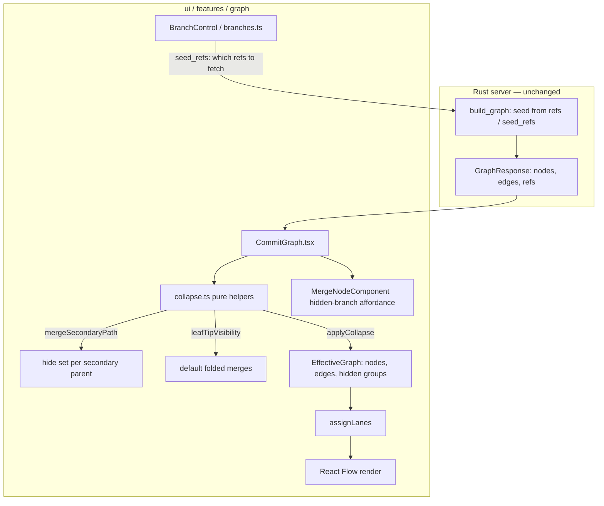
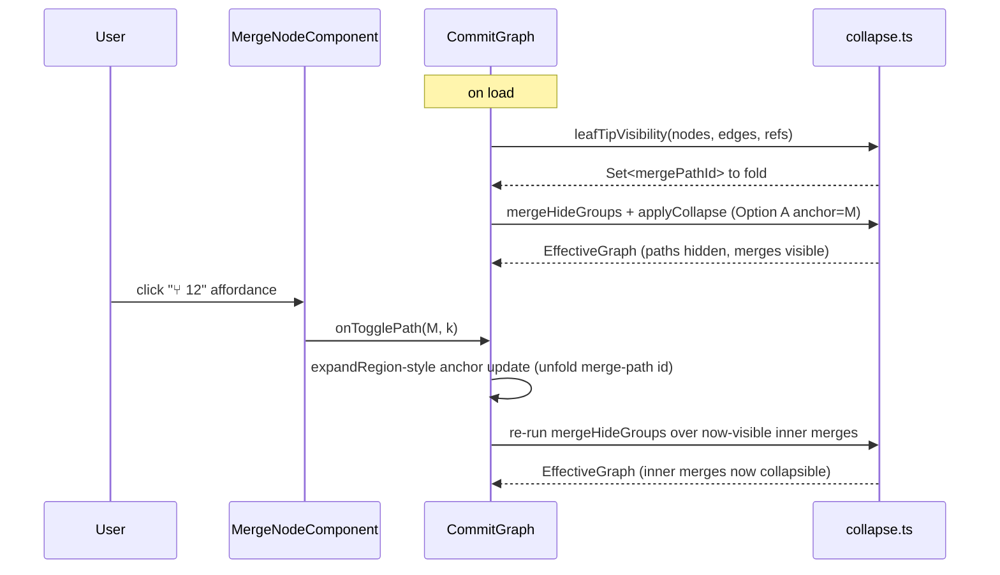
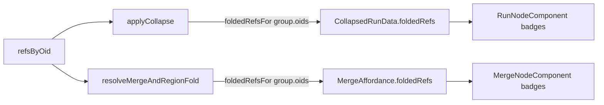

# Design Document: Merge Node Secondary Path

## Overview

Today the commit graph seeds from all refs and renders every reachable commit, then folds long *linear* stretches on demand (the Round 3 contiguous-region collapse from the `orphan-node-collapse-bug` fix). The result is still cluttered: every merged-in branch's full history is drawn, even when that work is long done and lives only behind a merge commit.

This feature makes **merge commits a first-class, collapsible node type**. A merge commit `M` has a first parent `P1` (the mainline continuation) and one or more secondary parents `P2..Pn` (the merged-in branch tips). For each secondary parent `Pk`, we compute a **secondary-path hide set** — the commits reachable from `Pk` but *not* reachable from `P1` — and hide it by default, leaving `M` visible as the expand point. The hide set is a **sub-DAG** (branch-shaped, not necessarily linear), is **orphan-safe by construction**, and is **recursive** (a hidden secondary path can contain its own inner merges, which become collapsible in turn).

On load, the graph shows only the **leaf frontiers**: local branch tips (and HEAD) that are not reachable from any *other* local tip — i.e. the trunk plus the currently-active, un-merged lines. Everything already merged collapses behind its merge node. This is a pure, client-side topological view computed from the already-loaded DAG; it needs no server round-trip and no external comparison set. It coexists with (does not replace) Round 3 region-collapse and coordinates with — but does not merge into — the existing branch panel.

This is a **new feature** built on top of the completed `orphan-node-collapse-bug` bugfix. It reuses that fix's anchor-keyed collapse/expand plumbing and `applyCollapse` edge-rerouting rather than reimplementing folding.

---

## Architecture



Two coordinated controls with distinct jobs:

- **Branch panel (`BranchControl` + `branches.ts`)** — *coarse, ref-name-based, server-side seeding.* Decides **which refs are fetched** (`seed_refs` → `build_graph` in `server/src/git/graph.rs`). Governs the *set of commits that exist in the client at all.*
- **Merge nodes (this feature)** — *precise, topological, client-side.* Decides **secondary-path visibility within the already-loaded DAG.** Works even for merged-in branches whose refs were deleted (there is no ref to name; the merge topology is enough).

They stay consistent where they overlap (see *Branch Panel Coordination*) but remain **two separate controls**.

### Where the new logic lives

- **`ui/src/features/graph/collapse.ts`** — new pure helpers: `mergeSecondaryPath`, `mergeParentClassification`, `reachableFrom`, `mergeBaseFromEdges`, `leafTipVisibility`, `mergeHideGroups`. Unit-tested under Vitest, no DOM (matches the project's pure-function testing convention).
- **`ui/src/features/graph/MergeNodeComponent.tsx`** — new React Flow node type rendering a merge commit with a "hidden branch" affordance.
- **`ui/src/features/graph/CommitGraph.tsx`** — wires merge fold state into the existing anchor-keyed `collapseRegion`/`expandRegion` model and `applyCollapse`; registers the `merge` node type.
- **Server (`server/src/git/graph.rs`)** — **no change required.** `merge_base` is computed client-side from the loaded edges (see *Merge Base*). A server assist is discussed and deferred (Open Questions).

---

## Data Models

The client already receives everything needed. Each `CommitNode` carries its `parents` (ordered — `parents[0]` is the first parent `P1`), and `edges` run `parent (source) → child (target)`. No new server types.

New client-side types in `collapse.ts`:

```typescript
/** Classification of a commit's parents for merge folding. */
export interface MergeParents {
  mergeOid: string;
  firstParent: string;          // P1 — mainline continuation
  secondaryParents: string[];   // P2..Pn — merged-in tips, in parent order
}

/**
 * A hidden secondary path behind a merge, keyed on (mergeOid, parentIndex).
 * The hide set is a SUB-DAG (branch-shaped), not necessarily a linear chain.
 */
export interface MergeHideSet {
  mergeOid: string;
  parentIndex: number;    // index into CommitNode.parents (>= 1)
  secondaryParent: string; // the Pk this path descends from
  oids: string[];         // hidden commits, newest-first in graph order
  mergeBase: string | null; // merge_base(P1, Pk); the floor (stays visible)
}

/** Synthetic id for a merge's hidden secondary-path group. Anchored on the merge
 *  so its fold identity is stable as the graph shifts (same rationale as the
 *  Round-3 region anchor — Defect 1.9 of the bugfix). */
export const mergePathId = (mergeOid: string, parentIndex: number) =>
  `__merge__${mergeOid}__${parentIndex}`;
export const isMergePathId = (id: string) => id.startsWith("__merge__");
```

`isCollapsedRunId` in `collapse.ts` is extended so merge-path ids are also treated as summary/hidden-group ids (for MiniMap coloring and jump handling), joining `__run__`, `__branch__`, `__region__`:

```typescript
export const isCollapsedRunId = (id: string) =>
  id.startsWith("__run__") || id.startsWith("__branch__")
  || isRegionId(id) || isMergePathId(id);
```

---

## Components and Interfaces

### Core Pure Helpers (signatures + specs)

All helpers operate over the already-loaded `nodes`/`edges` (no server call), mirroring `regionAround`/`regionsFromAnchors`.

#### `reachableFrom(roots, nodes, edges)`

```typescript
/**
 * Set of commits reachable from any root by walking PARENT links (ancestors,
 * inclusive of the roots). Edges run parent(source) → child(target), so we
 * follow target → sources. Bounded to in-graph commits.
 */
export function reachableFrom(
  roots: string[],
  nodes: CommitNode[],
  edges: CommitEdge[],
): Set<string>;
```

**Preconditions:** `roots` are commit oids (may be out-of-graph; those contribute nothing).
**Postconditions:** returns the ancestor closure of `roots ∩ inGraph`; every returned oid is in-graph; `roots ∩ inGraph ⊆ result`.

#### `mergeBaseFromEdges(a, b, nodes, edges)`

```typescript
/**
 * Best-effort merge base of two commits computed from the loaded DAG: a commit
 * reachable from both `a` and `b` with no descendant that is also reachable
 * from both (a lowest common ancestor over the loaded edges). Returns null when
 * no common ancestor is present in the loaded window.
 */
export function mergeBaseFromEdges(
  a: string, b: string, nodes: CommitNode[], edges: CommitEdge[],
): string | null;
```

**Note.** For the hide-set computation we do **not strictly need** the merge base as a separate value — `reachable(Pk) \ reachable(P1)` already excludes everything at or below any common ancestor (the base and its ancestors are reachable from `P1`). `mergeBaseFromEdges` is provided for display ("branch off @ <base>") and as an explicit floor assertion in tests. See *Merge Base* below.

#### `mergeSecondaryPath(mergeOid, parentIndex, nodes, edges)`

```typescript
/**
 * The hide set for one secondary parent of a merge: commits reachable from
 * Pk = parents[parentIndex] but NOT reachable from P1 = parents[0].
 *
 *   hide(M, k) = reachable(Pk) \ reachable(P1)
 *
 * This is a SUB-DAG (it may contain inner merges → branch-shaped), ordered
 * newest-first by graph order. Returns null when parentIndex is not a valid
 * secondary parent (< 1 or out of range) or the hide set is empty (nothing
 * unique to this side — e.g. an already-fully-merged parent).
 */
export function mergeSecondaryPath(
  mergeOid: string,
  parentIndex: number,
  nodes: CommitNode[],
  edges: CommitEdge[],
): MergeHideSet | null;
```

**Preconditions:** `mergeOid ∈ inGraph`; `parents[parentIndex]` exists.
**Postconditions:**
- `result.oids = reachable(Pk) \ reachable(P1)`, restricted to in-graph.
- `P1 ∉ result.oids` and every ancestor of `P1` ∉ `result.oids` (**orphan-safety floor**).
- `Pk ∈ result.oids` whenever `Pk ∉ reachable(P1)` (i.e. the secondary tip is hidden unless it was already merged into the mainline).
- `M ∉ result.oids` (the merge itself stays visible as the expand point).

#### `mergeHideGroups(mergeOid, nodes, edges)`

```typescript
/**
 * All secondary-path hide sets for a merge (one per secondary parent). For an
 * octopus merge (n parents) this yields up to n-1 independently collapsible
 * groups (Open Question 1: per-secondary-parent is the recommended default).
 */
export function mergeHideGroups(
  mergeOid: string, nodes: CommitNode[], edges: CommitEdge[],
): MergeHideSet[];
```

#### `leafTipVisibility(nodes, edges, refs)`

```typescript
/**
 * Compute the DEFAULT-view fold seed: which merges' secondary paths are folded
 * on load. A "line" is shown only when its tip is a LEAF frontier — a LOCAL
 * branch tip or HEAD that is NOT reachable from any OTHER local tip / HEAD.
 * Remote-tracking refs and tags are NOT counted as "other tips" (so a branch
 * caught up with its remote doesn't collapse itself, and fetching doesn't cause
 * flicker). Everything reachable from another local tip is "already merged" and
 * is folded behind its merge node's secondary-path hide set.
 *
 * Returns the set of merge-path ids (mergePathId(...)) to fold by default.
 */
export function leafTipVisibility(
  nodes: CommitNode[],
  edges: CommitEdge[],
  refs: RefLabel[],
): Set<string>;
```

**Algorithm (default view):**

```typescript
// 1. Candidate tips: local branches (kind === "branch") + HEAD. Ignore
//    remotebranch and tag kinds entirely for "other tip" comparison.
// 2. leafTips = tips whose oid is NOT in reachableFrom(otherTips) — i.e. not an
//    ancestor of any other local tip. These are the active/un-merged frontiers
//    plus the trunk.
// 3. visible = reachableFrom(leafTips)  (the union of all leaf lines' history)
// 4. For every merge M in `visible`, for every secondary parent Pk:
//      if hide(M, k) is disjoint from `visible-via-leaf-first-parents`
//      (i.e. the secondary path is not itself a leaf line), fold it.
//    In practice: fold hide(M,k) unless Pk (or a descendant in the hide set) is
//    itself a leafTip — because then that line is meant to stay open.
// 5. Return { mergePathId(M, k) } for each folded secondary path.
```

The precise fold predicate is: **fold `hide(M, k)` iff none of its members is a leaf tip.** A merged-in branch whose ref still exists *and is a leaf* (e.g. a long-lived un-merged-elsewhere branch) stays open; a merged-in branch that is subsumed by the trunk/another line folds.

### Algorithmic detail: default view (worked cases)

The subtraction `reachable(Pk) \ reachable(P1)` handles the awkward cases the user called out, with no special-casing:

| Case | Behavior | Why |
|---|---|---|
| **Feature branch merged once into trunk** | Feature-only commits hidden; merge visible with affordance. | They're reachable from `Pk`, not from `P1`. |
| **Same branch merged to origin multiple times** | Earlier-merged commits stay visible; only the *new* commits of the latest merge hide. | Already-merged commits are reachable from `P1` (they're on the mainline now) → excluded from the hide set. |
| **Origin merged INTO the feature branch** | Origin's commits stay visible; the feature's own commits hide — and the hide set can itself contain a merge node. | Origin commits are reachable from `P1`; the feature's contribution is a **sub-DAG with its own inner merge** → recursion. |
| **Octopus merge (3 parents)** | Two independent hide sets, each its own affordance. | `mergeHideGroups` yields one `MergeHideSet` per secondary parent. |

**Recursion.** Because a hidden secondary path is a sub-DAG that may contain inner merges, those inner merges are *also* merge nodes. They aren't rendered while the outer path is folded, but expanding the outer merge reveals them as collapsible merge nodes — "turtles all the way down." No extra machinery: after an expand, `mergeHideGroups` re-runs over the now-visible inner merges.

### Edge Rerouting & Orphan-Safety

**Claim.** Folding `hide(M, k)` cannot strand ("orphan") any other rendered node.

**Argument.** Let `H = reachable(Pk) \ reachable(P1)`. Take any rendered node `x ∉ H` that had a parent edge into `H` — i.e. some `h ∈ H` is a parent of `x`. Then `h` is an ancestor of `x`, so `x` is a *descendant* of `h`. The only way out of `H` toward newer commits is through `M` itself (every `h ∈ H` is reachable from `Pk`, and the sole rendered commit that has a `Pk`-side child crossing back to the mainline is the merge `M`, whose edge is `Pk → M`). Concretely: the only edge from inside `H` to a node outside `H` that we must preserve is the merge's own secondary edge `Pk → M`. `applyCollapse` reroutes that endpoint to the group's render id. Since `M ∉ H`, `M` stays visible and receives the rerouted edge, so no descendant is left parentless. Nodes reachable from `P1` are, by definition of `H`, all outside `H`, so the first-parent side is untouched. ∎

This is the same structural guarantee the Round 3 region fold relies on (single entry/exit), generalized: a merge secondary path has a **single exit** — the edge `Pk → M` — even though the hidden set is branch-shaped internally.

#### Reusing `applyCollapse` — and one required extension

`applyCollapse(nodes, edges, runs, expanded, nodeByOid)` currently:
- builds a `CollapsedRunData` summary node per collapsed `Run`,
- maps every folded oid → the run's synthetic id via `foldedInto`,
- reroutes edge endpoints through `renderId` and drops intra-group edges.

For merge folding we want a **different render shape**: **no free-floating rollup node.** The merge commit `M` itself is the expand point, so the hide set's members should reroute onto `M` (not onto a separate summary node). Two implementation options:

- **Option A — anchor the group on `M` (recommended).** Represent each folded secondary path as a group whose *render id is the merge oid `M`* rather than a new `__merge__` node. `foldedInto[h] = M` for every `h ∈ H`; `renderId` then reroutes the `Pk → M` edge to `M → M` (self-loop) which is dropped as intra-group, and there is no orphaning because `M` is already rendered. The affordance (count, chevron) is attached to `M`'s node data. This keeps the lane clean and needs only a small generalization of `applyCollapse` to accept groups whose render id is an *existing* commit rather than a minted summary node.
- **Option B — mint a hidden `__merge__` summary node** the way runs/regions do, positioned adjacent to `M`. Simpler reuse of `applyCollapse` unchanged, but adds a node in the lane, which the user explicitly does not want ("No free-floating rollup node in the lane").

**Decision:** implement **Option A**. Extend `applyCollapse` (or add a thin `applyMergeFold`) so a group may declare an **existing render anchor** (`renderAnchor?: string`) — when set, folded members map to that anchor instead of to a minted summary node, and no `CollapsedRunData` node is created. The merge's affordance metadata (`hiddenCount`, `hiddenGroups`) is threaded to `MergeNodeComponent` via the node's `data`.

Downstream, `assignLanes` and the dangling-edge filter operate on the effective node/edge set exactly as today; since `M` is a real rendered node, no lane or edge invariants change.

### MergeNodeComponent

A new React Flow node type `merge`, registered alongside `commit`/`special`/`run` in `CommitGraph.tsx`'s `nodeTypes`. It renders like `CommitNodeComponent` (same handle geometry — source on top toward children, target on bottom toward parents; see the handle note in `CommitNodeComponent.tsx`) plus a **hidden-branch affordance**.

```typescript
interface MergeNodeData {
  commit: CommitNode;              // the merge commit
  refs: RefLabel[];
  selected: boolean;
  onSelect: (oid: string) => void;
  /** Secondary paths and their folded/expanded state, one per secondary parent. */
  hiddenGroups: {
    parentIndex: number;
    id: string;                    // mergePathId(M, parentIndex)
    hiddenCount: number;           // commits hidden behind this path
    folded: boolean;               // currently folded?
  }[];
  /** Fold/expand a specific secondary path (anchor-keyed on the merge). */
  onTogglePath: (mergeOid: string, parentIndex: number) => void;
}
```

**Affordance UX:**
- When a secondary path is folded: a discoverable badge/chevron on the merge node, e.g. `⑂ 12` (a branch glyph + hidden-commit count), with a tooltip "12 commits on a merged-in branch — click to reveal." Clicking calls `onTogglePath` → expands that path.
- When expanded: the badge flips to a "collapse" affordance so the round-trip is reachable (mirrors how `CommitNodeComponent` offers a re-collapse control on a run head — Defect 4 of the bugfix).
- **Octopus merges:** one badge per secondary parent (per-secondary-parent control — Open Question 1 default), each independently toggleable.
- Merge nodes are visually distinct (e.g. the existing `GitMerge` glyph is already shown for 2+-parent commits; the merge node elevates it to a dedicated type with the branch affordance).



---

## Coexistence with Round 3 Region-Collapse

Both fold mechanisms live in `collapse.ts` and flow through `applyCollapse`, so they compose:

- **Region-collapse (Round 3)** folds **linear chains** on a *visible* line (long uninteresting stretches). Still driven by `autoCollapseAnchors` / `regionsFromAnchors` / anchor-keyed `collapseRegion`/`expandRegion`.
- **Merge secondary-path fold (this feature)** folds **branch-shaped sub-DAGs** and drives the **default view**.

They are applied in a defined order to keep membership disjoint:

1. Compute merge folds first (`leafTipVisibility` seed → `mergeHideGroups` → hidden member set `Hₘ`).
2. Run region detection **only over commits not in any `Hₘ`** (a commit already hidden behind a merge is not also a region candidate). `autoCollapseAnchors` receives the merge-hidden set as an exclusion so it does not seed regions inside hidden paths.
3. `applyCollapse` folds both group kinds in a single pass (as it already does for runs + rollups), producing one `EffectiveGraph`.

**Precedence when a commit is eligible for both** (Open Question 2): recommended default — **merge-path fold wins** (it reflects "this whole branch is merged," a stronger statement than "this linear stretch is long"). A commit hidden by a merge path is not offered a region control. Once a merge path is expanded, its now-visible linear stretches become normal region-collapse candidates again.

Anchor-keyed state is shared in spirit: merge-path fold state uses the same `foldAnchors`/`userExpanded` reversible model in `CommitGraph.tsx`, keyed on `mergePathId(M, k)` (which is anchored on the stable merge oid — no desync on graph shift, matching Defect 1.9). `collapseRegion`/`expandRegion` are generalized to accept either a region anchor oid or a merge-path id (both are stable-oid-derived synthetic anchors).

---

## Branch Panel Coordination

The branch panel (`BranchControl` + `branches.ts`) and merge nodes solve different layers and must not fight:

- **Panel = fetched set.** `shownBranchNames` → `refs` param → `seed_refs` in `build_graph`. Determines which commits exist client-side. `defaultVisibility` still collapses non-recent branches at the *fetch* layer.
- **Merge nodes = visibility within the fetched set.** Purely topological; independent of ref names; works when a merged-in branch's ref is gone.

**Consistency rules:**
- If the panel **hides** a branch (not fetched), its commits never arrive, so there is no merge-path to fold for it — no conflict.
- If the panel **expands** a branch (fetched + intended visible), and that branch's tip is a **leaf** local tip, `leafTipVisibility` keeps its line open — the two agree. If the panel expands a branch that is *actually already merged* (not a leaf), the merge node folds it by default; the user can still reveal it via the merge affordance. This is intentional: the panel says "fetch it," the merge node says "it's merged, hidden until you ask."
- A future enhancement (out of scope) could let the panel force a specific branch's line open by seeding `userExpanded` with the merge-path ids on its first-parent boundary. Recorded as a coordination hook, not built now.

### Panel-hidden vs. merge-hidden (two kinds of hidden)

The two controls produce two *different kinds* of hidden, at two different layers. Keeping them straight is the boundary between the controls.

**Panel-hidden = not seeded / not fetched.** Hiding a branch in `BranchControl` drops its name from `shownBranchNames`, so its tip is not in the `seed_refs` passed to `build_graph` (`server/src/git/graph.rs`). The server does `revwalk.push(tip)` per shown ref and walks *all* ancestors, with a `seen` set deduping — so the visible commit set is the **union of ancestors reachable from the still-shown tips**. Consequences:

- (a) A commit reachable **only** from the hidden branch's tip disappears — nothing shown seeds a walk that reaches it.
- (b) A commit **also** reachable from any shown branch (shared history, `main`, another visible feature branch) **stays visible**.
- (c) Hiding never punches holes in shared history or other paths — reachability from any shown tip always wins.
- (d) A commit reachable only from two hidden branches (and no shown branch) also disappears.

This is a coarse, **subtractive fetch filter**: the "unique-to-this-branch" set difference is *implicit* in the union-of-reachability, never explicitly computed. Panel-hidden commits are **not present client-side** and therefore **cannot be revealed by any client-side control** (merge nodes included) — you must un-hide the branch in the panel to refetch them.

**Merge-hidden = fetched + revealable.** A merge secondary-path hide set (`reachable(Pk) \ reachable(P1)`) is computed over commits that **were fetched and are in the client DAG**; they are merely folded behind the visible merge node and can be revealed by expanding it — **no refetch needed**.

**Coordination consequence.** These are different kinds of hidden operating at different layers — the **fetch layer** (panel) vs. the **client view layer** (merge nodes). The merge-node feature can only ever fold/reveal commits that the panel's fetch seed brought into the graph; it **cannot** reveal panel-hidden commits. That is the boundary between the two controls.

They remain **two coordinated controls**, never merged into one.

---

## Merge Base

`merge_base(P1, Pk)` is the floor of the hide set. Two ways to obtain it:

- **Client-side from loaded edges (recommended, default).** `mergeBaseFromEdges` computes a lowest common ancestor over `graph.edges`. Crucially, the *hide-set computation does not depend on it* — `reachable(Pk) \ reachable(P1)` already excludes the base and everything below (all reachable from `P1`). We compute the base only for display and test assertions. This matches the project's pure-function, offline testing approach and needs no server call since the DAG is already loaded.
- **Server assist via `git2::Repository::merge_base` (deferred).** Warranted only if we hit a case where the loaded window is *too small* to contain the true base (a partial fetch). In that case `reachable(Pk) \ reachable(P1)` is still correct for the *loaded* window (it only hides in-graph commits), so the risk is under-hiding, not orphaning. Flagged as a follow-up if partial-window artifacts appear; not implemented now.

**Decision:** client-side, from loaded edges.

---

## Correctness Properties

These are the design-level invariants the implementation must uphold. Each is stated as a universally-quantified property over the loaded DAG (`nodes`/`edges`) and directly informs the unit tests in *Testing Strategy*.

### Property 1: Hide-Set Definition

For every merge `M` and secondary parent index `k ≥ 1` with `Pk = M.parents[k]`:
`hide(M, k) = reachable(Pk) \ reachable(P1)`, restricted to in-graph commits. Consequently `P1 ∉ hide(M, k)`, every ancestor of `P1` ∉ `hide(M, k)`, and `M ∉ hide(M, k)` (the merge stays visible as the expand point). `Pk ∈ hide(M, k)` **iff** `Pk ∉ reachable(P1)` — i.e. the secondary tip is hidden unless it was already merged into the mainline.

**Validates: Requirements 2.1, 2.2, 2.3, 2.4, 2.5**

### Property 2: Orphan-Safety

Folding `hide(M, k)` never strands a rendered node: for every rendered `x ∉ hide(M, k)` that had a parent in `hide(M, k)`, `x` remains reachable after the fold. The **sole** edge crossing the fold boundary from inside `hide(M, k)` to a visible node is the merge's secondary edge `Pk → M`, and `applyCollapse` reroutes exactly that endpoint onto the still-visible `M`. (Proved in *Edge Rerouting & Orphan-Safety*; checked by `orphanedMembers(...) === []` in tests.)

**Validates: Requirements 3.1, 3.2, 3.3, 3.4**

### Property 3: Recursion

A hidden secondary path is a sub-DAG that may contain inner merges. Every inner merge is itself a merge node: while the outer path is folded it is not rendered, and expanding the outer merge makes each inner merge an independently collapsible merge node. `mergeHideGroups` re-run over the newly-visible commits yields the inner merges' hide sets.

**Validates: Requirements 4.1, 4.2, 4.3**

### Property 4: Default-View Leaf-Tip

In the default view a line is shown **iff** its tip is a local branch tip or HEAD that is not reachable from any *other* local tip / HEAD. Remote-tracking refs and tags are excluded from the "other tips" comparison. Every merge whose secondary path is not itself a leaf line is folded by default; formally, `leafTipVisibility` returns `mergePathId(M, k)` for `hide(M, k)` iff none of its members is a leaf tip.

**Validates: Requirements 5.1, 5.2, 5.3, 5.4**

### Property 5: Reversibility

Fold/expand is a lossless round-trip: for any merge-path id, `fold → expand → fold` restores an effective graph identical to the first fold. State is keyed on `mergePathId(M, k)` (anchored on the stable merge oid), so it does not desync when the graph window shifts.

**Validates: Requirements 6.1, 6.2, 6.3**

### Property 6: Coexistence Precedence

When a commit is eligible for both merge-path fold and Round-3 region-collapse, the merge-path fold wins: the commit is not offered a region control while hidden behind a merge, and region candidacy returns only after the merge path is expanded. Merge-hidden members are excluded from region seeding, keeping the two group memberships disjoint.

**Validates: Requirements 7.1, 7.2, 7.3, 7.4**

---

## Error Handling

All handling is client-side and topological; there is no server call and no exception path to recover from. The cases below are degenerate/boundary inputs whose defined behavior keeps the view correct and never orphans a node.

### Out-of-window merge base

**Condition:** the loaded graph window omits the true `merge_base(P1, Pk)` (e.g. a partial fetch).
**Response:** the hide-set computation does not depend on the base — `reachable(Pk) \ reachable(P1)` only ever hides in-graph commits — so the result stays correct for the loaded window. `mergeBaseFromEdges` returns `null` for the display/floor value.
**Recovery / risk:** the failure mode is *under-hiding* (some secondary commits stay visible), never orphaning. If real repos surface this, the deferred server-side `git2::Repository::merge_base` assist (see *Merge Base* / Open Question 4) can supply the true base.

### Secondary parent not in the loaded graph

**Condition:** `Pk = M.parents[k]` is not an in-graph commit (its subtree was not fetched).
**Response:** `reachableFrom` treats out-of-graph roots as contributing nothing, so `hide(M, k)` is empty; `mergeSecondaryPath` returns `null` for that parent index and no affordance is created for it.
**Recovery:** the merge renders normally with only the affordances for its in-graph secondary parents.

### Empty hide set (nothing unique to the side)

**Condition:** `Pk` is already fully reachable from `P1` (e.g. an already-fully-merged parent, or a fast-forward-style merge).
**Response:** `hide(M, k)` is empty and `mergeSecondaryPath` returns `null`; the merge shows **no** hidden-branch affordance for that parent.
**Recovery:** none needed — this is the correct "nothing to reveal" state.

### Invalid or out-of-range parent index

**Condition:** `parentIndex < 1` (the first parent is never a secondary path) or `parentIndex ≥ M.parents.length`.
**Response:** `mergeSecondaryPath` returns `null`; `mergeHideGroups` simply omits that index. No group and no affordance are produced.

### Merge scrolled out of the window while folded

**Condition:** a folded merge-path id references a merge `M` whose oid is no longer present in the current loaded window.
**Response:** because fold state is anchored on the stable merge oid, a stale `mergePathId(M, k)` whose `M` is absent matches no rendered node and is inert — it neither hides visible commits nor orphans anything. When `M` re-enters the window, its fold state re-applies.
**Recovery:** stale anchors may be garbage-collected on refresh; correctness does not depend on it (mirrors the Round-3 anchor rationale, Defect 1.9).

### Octopus merge edge cases

**Condition:** a merge with `n ≥ 3` parents, where some secondary parents have empty hide sets and others do not, or hide sets overlap.
**Response:** `mergeHideGroups` yields one `MergeHideSet` per secondary parent with a non-empty hide set (empty ones are dropped per the *empty hide set* case), each independently foldable with its own affordance. Overlap between two secondary hide sets is handled by the single-pass `applyCollapse` (a commit folded by either group is hidden once); expanding one path re-reveals only the commits unique to it.

---

## Testing Strategy

Follows project conventions: **pure functions in `collapse.ts` are unit-tested under Vitest (node env, no DOM)**; React components / React Flow are verified via `build + manual` (see steering "Not (yet) tested"). Frontend tests are colocated `*.test.ts`.

### Unit tests (Vitest, `collapse.test.ts` / new `merge.test.ts`)

Build small in-memory `CommitNode[]` / `CommitEdge[]` fixtures (fixed timestamps, deterministic, offline).

- **`mergeSecondaryPath` — hide-set correctness:**
  - Simple feature merge: hide set == feature-only commits; `P1` and its ancestors excluded; `M` excluded; `Pk` included.
  - Already-merged-again: earlier commits (now on `P1`) excluded from the new hide set.
  - Origin-merged-into-branch: `P1`-reachable origin commits excluded; hide set contains an **inner merge** (assert a member has `parents.length >= 2`) — proves sub-DAG shape.
  - Octopus: `mergeHideGroups` returns one set per secondary parent; sets are disjoint or correctly overlapping per definition.
- **Orphan-safety (property-style):** for every fixture and every merge/parent, assert that folding `hide(M,k)` via the Option-A `applyCollapse` leaves **`orphanedMembers(...) === []`** (reuse the existing `orphanedMembers` invariant checker). Also assert the sole cross-boundary edge is `Pk → M`.
- **`leafTipVisibility` — default view:**
  - Trunk + one un-merged feature branch → feature line stays open (its tip is a leaf), nothing folded.
  - Trunk with a merged feature (ref deleted) → feature folded behind its merge node.
  - Branch caught up to its remote (`remotebranch` at same/newer oid) → local branch does **not** fold itself (remote refs ignored as "other tips").
  - Tag on a merged commit → tag does not keep the line open (tags ignored).
- **Recursive nested merges:** fold outer merge → inner merge not rendered; expand outer → inner merge appears as a collapsible merge node; expanding inner reveals its own contribution.
- **Coexistence:** a commit eligible for both region-collapse and merge-fold is claimed by the merge fold (precedence); after expanding the merge path, region candidates reappear.
- **`mergeBaseFromEdges`:** returns the expected LCA for linear and branchy fixtures; `null` when no common ancestor in-window; hide set is unaffected by base presence/absence.
- **Reversibility (round-trip):** fold → expand → fold on a merge-path id restores identical effective graph (anchor-keyed state, mirroring Defect 4 tests).

### Build + manual (per conventions)

`MergeNodeComponent` rendering, affordance discoverability, octopus multi-badge, MiniMap coloring of merge-path groups, and jump-to-folded-commit centering are verified via `mise run build` (frontend build/typecheck) + manual inspection, consistent with the project's stance on DOM/React Flow tests.

### Rust

No server logic changes ⇒ no new Rust tests. If a server `merge_base` assist is later adopted (Open Questions), it would be tested against real temp repos with the existing `temp_repo`/`commit` helpers in `graph.rs`.

---

## Open Questions

1. **Octopus merges (3+ parents): per-secondary-parent vs. one control.**
   *Recommended default:* **per-secondary-parent** — each `Pk` independently collapsible with its own affordance/badge on the merge node. Rationale: matches the hide-set model (`mergeHideGroups` already yields one set per parent) and gives finer control. To resolve in design/review; a single "reveal all merged branches" control could be added on top later.

2. **Coexistence precedence when a commit is eligible for both merge-fold and Round-3 region-collapse.**
   *Recommended default:* **merge-path fold wins**; the commit is not offered a region control while hidden behind a merge, and region candidacy returns after the merge path is expanded. To resolve in design/review.

3. **Is the leaf-tip default always on, or a toggle?**
   *Recommended default:* **on by default, with a global toggle** ("Active lines only" vs. "Full DAG") so power users can see everything without expanding each merge. The toggle would flip the `leafTipVisibility` seed on/off without discarding per-merge user expand/collapse state. To resolve in design/review.

4. *(Supporting)* **Partial-window merge base.** If real repos surface cases where the loaded window omits the true merge base and causes visible under-hiding, revisit the deferred server-side `git2::Repository::merge_base` assist. Default: client-side only until evidence warrants it.


---

## Ref Folding (follow-up)

> **Status:** follow-up change layered on top of the merge-node feature above. It
> makes **ref-carrying commits foldable** by graph topology and surfaces the refs
> of hidden commits as badges on the summary/affordance nodes so nothing silently
> disappears. Derived from Requirements 14–18. All existing behavior above is
> preserved; this section only extends `regionAround`'s foldability rule, threads
> folded-ref metadata through the fold pipeline, and adds badge rendering to
> `RunNodeComponent` and `MergeNodeComponent`. No server change.

### Motivation (the reported defect)

Region-collapse's `foldable(x)` predicate in `collapse.ts` (both `regionAround`
and the legacy `detectRuns`) currently disqualifies any commit that carries a
ref:

```typescript
// current — a ref of ANY kind makes the commit (and, transitively, its run) non-foldable
if ((refsByOid.get(oid)?.length ?? 0) > 0) return false; // has a ref/tag/HEAD
```

Consequence: a commit with a branch/remote-branch/tag ref — and every commit
*adjacent* to it, because the region walk stops at the non-foldable neighbor —
is denied an expand/collapse control, even when the topology is a perfectly
ordinary linear chain. In a real repo this stranded a whole cluster:

| oid (short) | ref carried | today | should be |
|---|---|---|---|
| `772eb2e` | `HEAD → main` | non-foldable (ref) | **non-foldable — it is HEAD** |
| `6f21bf7` | `origin/main` (remotebranch) | non-foldable (ref) | **foldable** by topology |
| `431b5c2` | *(none — between two ref commits)* | non-foldable (its neighbors block the run) | **foldable**, joins the region |
| `86bdb6f` | `tag: v…` | non-foldable (ref) | **foldable** by topology |

The only commit that should stay pinned inline is `772eb2e` — the checked-out
`HEAD`. Every other ref commit should fold like any linear commit, with its ref
resurfaced on the fold's summary node.

### 1. Foldable-by-topology-except-HEAD

Change the `foldable(x)` inner predicate in `regionAround` so **only the
checked-out HEAD commit** is exempted for ref reasons; every other ref is
irrelevant to foldability. Foldability becomes purely topological plus the HEAD
carve-out:

```typescript
// regionAround already receives refsByOid — reuse it to spot HEAD.
const isHead = (x: string): boolean =>
  (refsByOid.get(x) ?? []).some((r) => r.is_head || r.kind === "head");

const foldable = (x: string): boolean => {
  if (selectedOid === x) return false;      // selected commit stays inline (unchanged)
  if (isHead(x)) return false;              // NEW: only HEAD is ref-exempt (Req 15.1)
  if ((parentCount.get(x) ?? 0) !== 1) return false; // root or merge point (unchanged)
  if ((childCount.get(x) ?? 0) !== 1) return false;  // tip or branch point (unchanged)
  return true;
};
```

Key points:

- The old `refsByOid.get(x)?.length > 0` gate is **removed** and replaced by the
  narrower `isHead(x)` gate. A branch/remote-branch/tag ref no longer blocks
  folding of its own commit (Req 14.2) or its neighbors — the region walk no
  longer stops at a ref commit, so an interior commit between two ref commits
  joins the region (Req 14.3, 14.5).
- HEAD is identified from the data `regionAround` already has: the ref list in
  `refsByOid` for that oid contains an entry with `is_head === true` (the
  `RefLabel` produced by the server for the checked-out ref) or `kind === "head"`.
  No new parameter is needed.
- **Common case is unaffected.** When HEAD sits at a branch tip with zero
  in-graph children (the usual layout), the `childCount !== 1` rule already makes
  it non-foldable; the explicit `isHead` gate only bites for an **interior or
  detached HEAD** that happens to have exactly one parent and one child (Req
  15.4 — HEAD-at-tip stays non-foldable by topology; the carve-out is the
  belt-and-suspenders for the interior case).
- The **selected commit** exemption is retained exactly as before — orthogonal
  to refs.

**Where the change propagates (no other edits needed):**

- `regionsFromAnchors` — calls `regionAround`; inherits the new rule.
- `autoCollapseAnchors` — calls `regionAround` per anchor; now **may** seed a
  region that contains ref commits (Req 18.1). Its separate **HEAD-trunk
  first-parent-walk exemption is unchanged** (Req 18.3) — that walk uses
  `nodeByOid[cur].parents[0]` and never consulted `foldable`, so it still keeps
  the mainline expanded on load regardless of this predicate change.
- `resolveMergeAndRegionFold` — region side calls `regionAround`; inherits it.
- **Merge hide-set folding is untouched.** `mergeSecondaryPath` /
  `mergeHideGroups` / `leafTipVisibility` compute hide sets by
  **reachability** (`reachableFrom`), never via `foldable`. They already fold
  ref-carrying commits (a merged-in branch tip *is* a ref commit). So the merge
  side needs no predicate change — only the folded-ref **surfacing** below.
- `detectRuns`'s identical ref gate is legacy (superseded by the region model as
  the fold mechanism per the Round-3 comment) — it may be aligned to the same
  `isHead`-only rule for consistency, but it is not on the active fold path.

### 2. Folded-ref surfacing — data structures & threading

When a fold hides a ref-carrying commit, the ref must reappear on the fold's
render node so no branch/remote-branch/tag disappears (Req 16). The summary node
also has to say **where** the ref lives — on the fold's head (tip) member vs.
buried inside it (Req 17). Model this as additive metadata carried alongside the
existing fold data.

New shared type in `collapse.ts`:

```typescript
/** A ref carried by a commit hidden inside a fold, tagged with where it sits. */
export interface FoldedRef {
  ref: RefLabel;      // the branch / remotebranch / tag ref on a hidden commit
  buried: boolean;    // false → carried by the fold's head member (oids[0]);
                      // true  → carried by an interior (non-head) member
}

/**
 * Collect the refs carried by a group's member commits, tagged head-vs-buried.
 * `oids` is the group's ordered members, newest-first, so `oids[0]` is the head
 * member. A ref on `oids[0]` is head (buried=false); a ref on any later member
 * is buried (buried=true). Returns [] when no member carries a ref (Req 16.4).
 */
export function foldedRefsFor(
  oids: string[],
  refsByOid: Map<string, RefLabel[]>,
): FoldedRef[] {
  const out: FoldedRef[] = [];
  oids.forEach((oid, i) => {
    for (const ref of refsByOid.get(oid) ?? []) {
      out.push({ ref, buried: i > 0 });
    }
  });
  return out;
}
```

`buried` is decided by **member index**: `i === 0` is the head member `oids[0]`
(the newest / tip of the group), `i > 0` is buried (Req 17.1, 17.2).

**Threading into region rollups (`CollapsedRunData`).** `applyCollapse` builds
`CollapsedRunData` today and does **not** receive `refsByOid`. Extend it
additively:

- Add an optional `foldedRefs?: FoldedRef[]` field to `CollapsedRunData`.
- Thread `refsByOid` into `applyCollapse` (new trailing optional param, so the
  existing call sites in `resolveFoldState` keep compiling; the active caller
  `resolveMergeAndRegionFold` passes it through). When building each minted
  summary node, set `foldedRefs: foldedRefsFor(run.oids, refsByOid)`.
- **Core edge/fold logic is unchanged.** `foldedRefs` is pure display metadata
  attached to the already-built `CollapsedRunData`; `foldedInto`, `renderId`,
  edge rerouting, and the self-loop drop are all exactly as before.

```typescript
export interface CollapsedRunData {
  // …existing fields (kind, id, count, oids, firstSummary, lastSummary, …)…
  /** Refs carried by hidden members, tagged head-vs-buried (Req 16/17). Empty ⇒ no badge. */
  foldedRefs?: FoldedRef[];
}
```

**Threading into merge affordances (`MergeAffordance`).** For a folded secondary
path the "summary node" is the merge node's affordance, so the folded refs ride
on `MergeAffordance`. `resolveMergeAndRegionFold` already builds the affordance
list from `visibleMergeHideGroups`; it has `refsByOid` in scope (it takes it
today for region foldability). Extend the affordance shape:

```typescript
export interface MergeAffordance {
  parentIndex: number;
  id: string;
  hiddenCount: number;
  folded: boolean;
  /** Refs carried by commits on this secondary path, head-vs-buried (Req 16.2/17). */
  foldedRefs: FoldedRef[]; // = foldedRefsFor(group.oids, refsByOid)
}
```

For a merge path the head member is `group.oids[0]` (the secondary parent's tip
line, newest-first), so the same `foldedRefsFor(group.oids, refsByOid)` computes
head-vs-buried consistently with region rollups. Populate it where each
`MergeAffordance` is constructed in `resolveMergeAndRegionFold`.



### 3. Component rendering — head-vs-buried badge styling

Both summary renderers gain a folded-ref badge row. The **solid** style is the
exact badge markup already used on `CommitNodeComponent` (green for HEAD, yellow
for tag, orange for remotebranch, blue for branch); the **buried** style is a
distinct **outline/ghost** treatment — transparent background, dashed/solid
border in the same hue, muted text — with a tooltip stating the ref sits inside
the folded run (Req 17.2, 17.3). Distinction is **styling alone** — no position
number or count on the badge (Req 17.4).

Shared badge helper (colocated with the components, or a tiny `FoldedRefBadge`
in the graph feature) so both renderers stay identical:

```tsx
function FoldedRefBadge({ ref, buried }: FoldedRef) {
  const hue =
    ref.is_head ? "green" : ref.kind === "tag" ? "yellow"
    : ref.kind === "remotebranch" ? "orange" : "blue";
  // Solid (head member) reuses CommitNodeComponent's badge classes verbatim.
  // Buried uses transparent bg + border in the same hue + a tooltip.
  const cls = buried
    ? `bg-transparent text-${hue}-300/80 border border-dashed border-${hue}-700/60`
    : SOLID_BADGE_CLASSES[hue]; // identical to CommitNodeComponent
  return (
    <span
      title={buried ? `${ref.name} — inside this folded run` : ref.name}
      className={["px-1.5 py-0 rounded text-[10px] font-mono leading-4 max-w-full truncate inline-block", cls].join(" ")}
    >
      {ref.is_head ? "● " : ""}{ref.name}
    </span>
  );
}
```

- **`RunNodeComponent`** (region rollup): when `d.foldedRefs?.length`, render a
  `flex flex-wrap gap-1` row of `FoldedRefBadge` above the existing count/range
  header. Head refs solid, buried refs outline. No badge row when the array is
  empty (Req 16.4). Purely additive to the current JSX.
- **`MergeNodeComponent`** (secondary-path affordance): for each folded
  `hiddenGroups[k]` (i.e. `g.folded === true`) with `g.foldedRefs?.length`,
  render the same badge row on/next to that path's affordance button, so a ref
  hidden behind a merged-in branch is visible without expanding it (Req 16.2).
  The existing branch-glyph + hidden-count button is unchanged; the ref badges
  sit alongside it.

Tailwind note: the hue is one of a fixed known set, so use a static class map
(as sketched via `SOLID_BADGE_CLASSES`) rather than interpolated class names, to
stay compatible with Tailwind v4's content scanning (matching the existing
literal-class approach in `CommitNodeComponent`).

### 4. Auto-collapse on load

With refs now foldable, `autoCollapseAnchors` may seed a region that contains
ref-carrying commits (Req 18.1). This is acceptable precisely because the folded
refs resurface as badges on the region rollup (Req 18.2, via §2/§3). The
**HEAD-trunk first-parent-walk exemption is unchanged** (Req 18.3): that walk is
independent of `foldable`, so the checked-out mainline stays expanded on load
regardless of the predicate change.

### Correctness Properties (continued)

### Property 7: Foldable-by-Topology-Except-HEAD

For every in-graph commit `x`, `regionAround`'s `foldable(x)` is true **iff** `x`
has exactly one in-graph parent, exactly one in-graph child, is not the selected
commit, and is not the checked-out HEAD commit — independent of any
branch/remote-branch/tag ref on `x` or its neighbors. Consequently a ref-carrying
non-HEAD commit that meets the topology joins a region (and a commit between two
ref commits joins a region of ≥ 2 members), while the HEAD commit is never a
member of any region. The HEAD-at-tip case remains non-foldable by the one-child
rule.

**Validates: Requirements 14.1, 14.2, 14.3, 14.4, 14.5, 15.1, 15.2, 15.3, 15.4**

### Property 8: Folded-Refs Surfaced

For every folded group (region rollup or merge secondary path), the summary
node's `foldedRefs` equals exactly the branch/remote-branch/tag refs carried by
the group's hidden member commits: `foldedRefsFor(oids, refsByOid)` contains one
entry per (member, ref) pair and nothing else. A group whose members carry no ref
yields an empty `foldedRefs` and therefore no badge. This holds for region
rollups (`CollapsedRunData.foldedRefs`) and merge affordances
(`MergeAffordance.foldedRefs`) alike, and for the on-load auto-collapse seed.

**Validates: Requirements 16.1, 16.2, 16.3, 16.4, 18.1, 18.2**

### Property 9: Head-vs-Buried Styling

For every `FoldedRef` in a summary node, `buried === false` iff the ref's commit
is the group's head member `oids[0]`, and `buried === true` iff it is carried by
an interior member (index > 0). A head ref renders in the solid commit-node badge
style; a buried ref renders in a distinct outline style with a tooltip noting it
is inside the folded run. The two are distinguished by styling alone — no
position number or count on the badge.

**Validates: Requirements 17.1, 17.2, 17.3, 17.4**

### Testing Strategy (additions)

Follows the same convention as above — **pure functions unit-tested under Vitest
(node env, no DOM); component rendering verified build + manual.**

**New pure unit tests (`collapse.test.ts` / `merge.test.ts`):**

- **`regionAround` folds ref commits (Property 7 / Req 14):** fixture with a
  linear chain where interior commits carry branch/remotebranch/tag refs and none
  is HEAD → `regionAround(anchor)` returns a region that **includes** the ref
  commits; a commit sandwiched between two ref commits is a member of a ≥ 2-member
  region.
- **`regionAround` pins HEAD (Property 7 / Req 15):** fixture with an **interior**
  HEAD (one parent, one child, `is_head` ref) → HEAD is excluded from the region;
  the region splits around it or shrinks below 2 members as appropriate. Separate
  case: HEAD at a branch tip (zero children) stays non-foldable by topology.
- **HEAD detection source:** a commit carrying a non-HEAD ref plus, separately, a
  commit carrying an `is_head`/`kind === "head"` ref → only the latter is treated
  as HEAD by `foldable`.
- **`foldedRefsFor` head-vs-buried (Properties 8 & 9 / Req 16, 17):** group whose
  head member `oids[0]` carries a ref and an interior member carries another →
  the head ref has `buried === false`, the interior ref `buried === true`; a
  group with no refs → `[]`; multiple refs on one commit → one `FoldedRef` each.
- **`autoCollapseAnchors` with ref commits (Req 18):** long off-trunk region
  containing ref commits is still seeded (anchor emitted); a region intersecting
  the HEAD-trunk first-parent chain is still exempt (unchanged).
- **Merge path folded refs (Req 16.2):** a merged-in secondary path whose members
  carry refs → the corresponding `MergeAffordance.foldedRefs` lists them
  head-vs-buried by `group.oids` order.

**Build + manual (per conventions):** `RunNodeComponent` and `MergeNodeComponent`
folded-ref badge rendering — solid head badges, outline buried badges, tooltips,
wrapping — is verified via `mise run build` (typecheck) + manual inspection,
consistent with the project's stance on DOM/React Flow tests.

**Rust:** no server change ⇒ no new Rust tests.


---

## Fold-Control Placement & Selection Boundary (follow-up)

> **Status:** follow-up change layered on top of the merge-node feature and the
> Ref-Folding follow-up above. Derived from Requirements 19–23. It **corrects
> placement and selection behavior** over the existing `Region_Collapse` and
> merge secondary-path folds — it **adds no new folding mechanism**. All existing
> behavior above is preserved: this section only (1) moves the collapse control
> on a commit/merge node to the top-right so it lines up with the expand
> affordance already used on summary nodes, (2) removes the *selected commit*
> from `regionAround`'s `foldable(x)` predicate so selection is no longer a hard
> region boundary, and (3) makes a fold that hides the selected commit carry the
> selection onto the resulting summary node. Hide-set computation, orphan-safety,
> recursion, the leaf-tip default view, coexistence precedence, and folded-ref
> surfacing are all untouched. No server change.

### Motivation (the reported defects)

Two independent defects, both about *where a control lives* and *what selection
does to folding*.

**Defect (a) — control-placement inconsistency.** The **expand** affordance on a
summary node lives in a different spot than the **collapse** control on a commit
node, so the control *jumps* as a node folds/expands:

- On the summary nodes (`RunNodeComponent`, and the per-path affordance in
  `MergeNodeComponent`) the expand affordance reads as a top-right / node-level
  control.
- On a commit node (`CommitNodeComponent`) and on a merge node
  (`MergeNodeComponent`) the **collapse** control is a `ChevronsDownUp` button
  rendered *mid-left*, inside the hash/date row:

  ```tsx
  {/* CommitNodeComponent / MergeNodeComponent — hash + date row */}
  <div className="flex items-center justify-between gap-2 mb-0.5">
    <span className="font-mono text-[#8b949e] …">{commit.short_oid}</span>
    <span className="text-[#8b949e]">{dateStr}</span>
    {canCollapse && (
      <button onClick={…} title="Collapse this linear run of commits">
        <ChevronsDownUp size={11} />
      </button>
    )}
  </div>
  ```

  Because that button sits between the hash and the date rather than at the
  node's top-right corner, folding a commit (commit → summary) and expanding it
  again (summary → commit) makes the control hop from the hash/date row to the
  summary node's corner and back — a visible jump on every fold/expand.

**Defect (b) — selection-as-boundary.** `regionAround`'s inner `foldable(x)`
begins with:

```typescript
const foldable = (x: string): boolean => {
  if (selectedOid === x) return false;   // ← the defect
  if (isHead(x)) return false;
  if ((parentCount.get(x) ?? 0) !== 1) return false;
  if ((childCount.get(x) ?? 0) !== 1) return false;
  return true;
};
```

`foldable` is applied to **every** commit during the region walk — not only to
the anchor. The walk grows the region DOWN via first-parent and UP via the
single child *while each visited commit is `foldable`*. Since a non-foldable
commit stops the walk, the selected commit becomes a **hard region boundary**:
the walk halts at it in both directions. This silently shrinks the regions of
the selected commit's neighbors — often below the 2-member minimum — so
`regionAround` returns `null` for them and they lose their fold control, even
though the topology is an ordinary linear chain.

Concrete, confirmed chain (newest → oldest):

```
772eb2e (HEAD → main) → 6f21bf7 (origin/main) → 431b5c2 → 86bdb6f (tag) → 578f9c8
```

With the Ref-Folding follow-up applied, `6f21bf7` (remotebranch), `431b5c2`
(no ref), and `86bdb6f` (tag) are all foldable by topology; only `772eb2e` is
pinned (HEAD). Now **select `431b5c2`**:

- `regionAround("6f21bf7", …, selectedOid="431b5c2")` walks **down** via
  first-parent to `431b5c2` and stops there (selected → not foldable), and walks
  **up** to `772eb2e` and stops there (HEAD → not foldable). The region collapses
  to just `{6f21bf7}` — 1 member — so `regionAround` returns `null`.
- Result: `6f21bf7` has **no fold control** merely because its neighbor
  `431b5c2` is selected. Deselect, and the control reappears. That flicker is the
  reported bug.

The fix is to stop treating the selected commit as non-foldable at all (below),
which makes selection structurally irrelevant to region membership.

### 1. Consistent top-right control placement

Move the collapse control out of the mid-left hash/date row and render it at the
node's **top-right corner**, matching where the expand affordance already reads
on `RunNodeComponent` / `MergeNodeComponent`. Apply the identical move to both
`CommitNodeComponent` and `MergeNodeComponent` (they share the same hash/date
row markup and the same `canCollapse` / `onCollapse` props).

- Lift the `{canCollapse && <button …><ChevronsDownUp/></button>}` out of the
  `flex items-center justify-between` hash/date row and position it at the
  top-right of the node container (e.g. an absolutely-positioned control in the
  card's top-right, or a dedicated top-right header slot), so it occupies the
  same corner the summary node's expand affordance does.
- After the move, a node that folds (commit/merge → summary) and one that
  expands (summary → commit/merge) both keep their fold control in the **same
  top-right spot** — the control no longer jumps (Req 19.1, 19.2, 19.3).
- The summary-node expand affordance (`RunNodeComponent`, and each per-path
  button in `MergeNodeComponent`) is already at the node's top/corner; only the
  commit/merge collapse control needs relocating so the two line up.

This is a **component-only** change (JSX + Tailwind positioning). Consistent with
project conventions, control placement is verified via `mise run build`
(typecheck) + manual inspection — there is no pure logic to unit-test here.

### 2. Remove selection from the Foldable_Predicate

Delete the selection gate from `foldable(x)` inside `regionAround`. Before /
after (mirroring the Ref-Folding section's before/after):

```typescript
// BEFORE — selected commit is a hard region boundary
const foldable = (x: string): boolean => {
  if (selectedOid === x) return false;   // ← removed
  if (isHead(x)) return false;
  if ((parentCount.get(x) ?? 0) !== 1) return false;
  if ((childCount.get(x) ?? 0) !== 1) return false;
  return true;
};
```

```typescript
// AFTER — foldability is purely topological + the HEAD carve-out
const foldable = (x: string): boolean => {
  if (isHead(x)) return false;                        // only HEAD stays pinned
  if ((parentCount.get(x) ?? 0) !== 1) return false;  // root or merge point
  if ((childCount.get(x) ?? 0) !== 1) return false;   // tip or branch point
  return true;
};
```

After removal, `foldable` is exactly: **not HEAD, exactly one in-graph parent,
exactly one in-graph child** — nothing about selection or refs (the ref gate was
already removed by the Ref-Folding follow-up).

**Consequences:**

- **Selection never changes region structure (Req 20).** Because `foldable` no
  longer consults `selectedOid`, the region walk does not stop at the selected
  commit. `regionAround` returns the same members regardless of what is selected,
  so `regionsFromAnchors` / `resolveMergeAndRegionFold` produce the **same set of
  regions** before and after a selection (20.2), every other commit keeps the
  fold control it had (20.3), and no neighbor's membership shifts (20.4). In the
  worked chain above, selecting `431b5c2` no longer shrinks `6f21bf7`'s region —
  it stays a ≥ 2-member region with a control.
- **The selected commit is itself foldable and shows its own control (Req 21).**
  When the selected commit satisfies the topology rule it joins its region
  (21.1) and, in a ≥ 2-member region, is offered a fold control (21.2); the same
  topology rule and HEAD exception apply to it as to any other commit (21.3).
- **No orphans; membership otherwise unchanged (Req 23).** Dropping the gate only
  *adds* the selected commit back to region candidacy; it removes nothing and
  introduces no new members. Hide-set membership is unaffected (23.2), region
  membership is identical apart from ceasing to exclude the selected commit
  (23.3), orphan-safety still holds because folding still flows through the same
  single-entry/single-exit `applyCollapse` (23.1), and the HEAD-trunk auto-seed
  exemption and the topological predicate + HEAD exception are all unchanged
  (23.4, 23.5).

**`selectedOid` parameter cleanup.** With the gate gone, `selectedOid` is no
longer read inside `regionAround`, so it becomes an **unused parameter**. Two
options:

- **(recommended) Remove it from the signature** — drop `selectedOid` from
  `regionAround(oid, nodes, edges, refsByOid)` and update every caller:
  `regionsFromAnchors` (drop its own `selectedOid` param and the pass-through),
  `autoCollapseAnchors` (it currently passes `null`), and
  `resolveMergeAndRegionFold` (drop the pass-through; note it still receives
  `selectedOid` for the *selection-follow* logic in §3, so keep that parameter on
  `resolveMergeAndRegionFold` itself and just stop forwarding it to
  `regionAround`). The `CommitGraph.tsx` `regionEligible` memo also calls
  `regionAround` and drops the argument.
- **(alternative) Keep it for API stability** — leave the parameter in place,
  unused, to avoid touching call sites.

The tasks should follow the **remove-it** path: delete the parameter from
`regionAround` and `regionsFromAnchors` and update `autoCollapseAnchors`,
`resolveMergeAndRegionFold`, and the `CommitGraph.tsx` callers accordingly.

**Merge hide-set folding is untouched.** `mergeSecondaryPath` /
`mergeHideGroups` / `leafTipVisibility` compute hide sets by **reachability**
(`reachableFrom`), never via `foldable`, so removing the selection gate changes
nothing on the merge side (confirmed — Req 23.2). Only `regionAround` (and the
region path through `resolveMergeAndRegionFold`) is affected.

### 3. Folding a region containing the selected commit moves selection to the summary node

Today selection follows a fold only on the *expand* path: `onNodeClick`, when a
summary node is clicked, calls `expandRegion` then
`selectionForSummaryNode(node.id, runNodes)` and re-selects the representative
commit. There is **no** matching behavior on the *fold* path — folding a region
that contains the selected commit currently strands the selection on a
now-hidden commit. Req 22 fixes the fold direction.

The single fold entry point is `collapseRegion(anchorId)` in `CommitGraph.tsx`
(used by both the commit/merge collapse control via `onCollapse` and by
`onTogglePath` for merge paths). Extend it so that **when the fold's members
include the currently selected commit, the selection moves onto the resulting
summary node**, driving the right-hand detail pane from that node's
representative commit — the fold's **newest member**, `oids[0]` — reusing the
existing `selectionForSummaryNode(nodeId, runNodes)` helper (which already
returns `oids[0]`).

Where the decision lands in `CommitGraph.tsx`:

- `collapseRegion(anchorId)` records the fold override, then determines the
  members of the group being folded for `anchorId`:
  - for a region id, the members are `regionAround(anchorFromId(anchorId), …)`;
  - for a `mergePathId(M, k)` (`isMergePathId(anchorId)`), the members are the
    corresponding `mergeSecondaryPath(M, k, …).oids` (equivalently the group's
    `oids` from the resolver).
- If `selectedOid` is among those members, call `onSelectCommit` with the fold's
  representative. Because `collapseRegion` runs *before* the resolver recomputes
  `runNodes`, the representative is taken directly as the group's newest member
  (`members[0]` / `oids[0]`) — the same value `selectionForSummaryNode` yields
  once the summary node exists; using `oids[0]` keeps the two directions
  consistent (22.1, 22.2).
- If `selectedOid` is **not** among the folded members, leave the selection
  unchanged (22.3). This applies to both region folds and merge secondary-path
  folds (the requirement names both).

No new helper is needed: the representative rule (`oids[0]` = newest member) is
already centralized in `selectionForSummaryNode`, and the fold-membership sets
are already computed by `regionAround` / `mergeSecondaryPath`.

### Correctness Properties (continued)

### Property 10: Consistent Top-Right Fold-Control Placement

For every node that offers a `Fold_Control`, the control renders at the node's
top-right position: the expand affordance on a summary node (region/run rollup
or merge affordance) and the collapse control on a commit/merge node that
anchors a foldable region occupy the same top-right corner. Consequently a node
transitioning folded ⇄ expanded keeps its fold control in the same top-right
spot — the control does not move. (Component placement; verified build + manual.)

**Validates: Requirements 19.1, 19.2, 19.3**

### Property 11: Selection Is Not a Region Boundary

For every in-graph commit `x`, `regionAround`'s `foldable(x)` is independent of
`selectedOid`: it is true **iff** `x` has exactly one in-graph parent, exactly
one in-graph child, and is not the checked-out HEAD commit. Consequently, for
any selection, the set of regions produced by `regionsFromAnchors` /
`resolveMergeAndRegionFold` is identical to the set produced under any other
selection (regions and every commit's region membership are selection-invariant);
a selected commit that meets the topology joins its region and, in a ≥ 2-member
region, is offered a control; and removing the selection gate introduces no
orphan and leaves Hide_Set membership and region membership unchanged apart from
ceasing to exclude the selected commit. The HEAD carve-out and the HEAD-trunk
auto-seed exemption are unchanged.

**Validates: Requirements 20.1, 20.2, 20.3, 20.4, 21.1, 21.2, 21.3, 23.1, 23.2, 23.3, 23.4, 23.5**

### Property 12: Fold Moves Selection to the Summary Node

For every fold (region collapse or merge secondary path) whose member set
includes the selected commit, the selection moves to the resulting summary node
and the right-hand detail pane is driven from that node's representative commit,
which is the fold's newest member `oids[0]` (as returned by
`selectionForSummaryNode`). For every fold whose member set does not include the
selected commit, the selection is left unchanged.

**Validates: Requirements 22.1, 22.2, 22.3**

### Testing Strategy (additions)

Follows the same convention as above — **pure functions unit-tested under Vitest
(node env, no DOM); component/placement work verified build + manual.**

**New pure unit tests (`collapse.test.ts` / `merge.test.ts`):**

- **`regionAround` no longer excludes the selected commit (Property 11 / Req 20,
  21, 23):** regression test reproducing the confirmed chain
  `772eb2e (HEAD→main) → 6f21bf7 (origin/main) → 431b5c2 → 86bdb6f (tag) → 578f9c8`
  with fixed timestamps. Select `431b5c2` and assert `regionAround("6f21bf7", …)`
  is **not** shrunk to `{6f21bf7}` — before the fix it collapses to a single
  member (walk down stops at the selected `431b5c2`, walk up stops at HEAD
  `772eb2e`), after the fix it stays a ≥ 2-member region and `6f21bf7` retains a
  control. Assert the region set is byte-for-byte identical across several
  different selections (selection-invariance, 20.2).
- **Selected commit is a member of its region (Property 11 / Req 21):** with the
  selected commit satisfying the topology rule, `regionAround(selected, …)`
  returns a region that **includes** the selected commit, and the region has
  ≥ 2 members so a control is offered.
- **HEAD/topology unchanged (Req 23.5):** the HEAD carve-out still pins HEAD and
  the one-parent/one-child rule is unchanged after the parameter removal (reuse
  the existing HEAD-detection fixtures).
- **`selectionForSummaryNode` returns the newest member (Property 12 / Req 22):**
  for a fold that contained the selected commit, `selectionForSummaryNode(id,
  runNodes)` returns the group's newest member `oids[0]`; assert the value
  matches the representative the fold path selects. A fold that does not contain
  the selected commit leaves the selection unchanged (assert the fold-membership
  test is what gates the re-selection).

**Build + manual (per conventions):** the top-right collapse-control placement on
`CommitNodeComponent` / `MergeNodeComponent` (and its alignment with the summary
nodes' expand affordance so the control does not jump on fold/expand) is verified
via `mise run build` (typecheck) + manual inspection, consistent with the
project's stance on DOM/React Flow tests.

**Rust:** no server change ⇒ no new Rust tests.


---

## Fold-Control Visibility & Placement Fix (follow-up)

> **Status:** follow-up change layered on top of the merge-node feature, the
> Ref-Folding follow-up, and the Fold-Control Placement & Selection Boundary
> follow-up above. It **corrects on-screen defects that survived the previous
> round** — it adds no new folding mechanism to the hide-set / region model. All
> prior behavior is preserved: this section (1) stops the top-right control from
> occluding the topmost content (the date) on any node type, (2) moves
> `RunNodeComponent`'s expand affordance into the same top-right corner as the
> commit/merge collapse control so fold and expand share one corner across all
> three node types, and (3) **broadens fold-control eligibility** so every node
> that participates in — or is adjacent to — a foldable linear region shows a
> control, not just strict run-heads. Hide-set computation, orphan-safety,
> recursion, the leaf-tip default view, coexistence precedence, folded-ref
> surfacing, the HEAD carve-out, and selection-invariance are all untouched. No
> server change.

### Motivation (the reported defects — confirmed by manual inspection)

The previous follow-up round (Requirements 19–23, Properties 10–12) intended to
place the fold control top-right and remove the selection boundary. In practice
the on-screen result is still wrong. Three independent defects remain.

**Defect (1) — the control renders *behind* the date.** In
`CommitNodeComponent` and `MergeNodeComponent` the collapse control is an
absolutely-positioned button on the card's `relative` root:

```tsx
{canCollapse && (
  <button className="absolute top-1 right-1 z-10 …" onClick={…} title="Collapse this linear run of commits">
    <ChevronsDownUp size={11} />
  </button>
)}
```

The hash/date row sits in **normal flow** at the top of the card:

```tsx
<div className="flex items-center justify-between gap-2 mb-0.5">
  <span className="font-mono text-[#8b949e] …">{commit.short_oid}</span>
  <span className="text-[#8b949e]">{dateStr}</span>
</div>
```

When a node has **no ref badges**, the hash/date row *is* the topmost row, so the
absolutely-positioned button floats directly over the date text. The existing
right-padding carve-out was applied **only to the ref-badge row**
(`refs.length > 0 && <div className={[…, canCollapse ? "pr-5" : ""]…}>`), which
reserves no space at all when there are no ref badges. The date is therefore
occluded on exactly the common case (a plain commit with no branch/tag).

**Fix.** Reserve horizontal space for the control on **whichever row is
topmost** — the hash/date row must also receive right-padding when the control is
present — OR give the card a dedicated reserved top-right slot that content never
flows under. The date **must never be occluded on any node**, regardless of
whether ref badges are present.

**Defect (2) — inconsistent corner vs. summary/run nodes.**
`RunNodeComponent` renders its **expand** affordance as a `ChevronsUpDown` icon
in a top-**left** header row:

```tsx
<div className="flex items-center gap-1.5 mb-0.5 text-purple-200 font-semibold">
  <ChevronsUpDown size={12} className="text-purple-300 shrink-0" />
  <span className="min-w-0 truncate" title={labelText}>{labelText}</span>
</div>
```

So the **collapse** control (commit/merge nodes, top-right) and the **expand**
control (run/summary nodes, top-left) sit in **different corners** — a real
inconsistency, contradicting the prior round's Property 10 claim that all
controls are already top-right.

**Fix.** Give `RunNodeComponent` a **top-right** expand control matching the
commit/merge nodes' top-right collapse control, so fold and expand share the
**same corner** across all three node types (`CommitNodeComponent`,
`MergeNodeComponent`, `RunNodeComponent`). The run node currently also expands on
a click **anywhere** on the node; that whole-node click **may remain**, but the
visible affordance must **also** be top-right for consistency.

**Defect (3) — the control is missing on many nodes (the substantive new
behavior).** Today eligibility is computed per node in `CommitGraph.tsx`:

```tsx
const regionEligible = useMemo(() => {
  const set = new Set<string>();
  for (const n of graph.nodes) {
    if (resolved.mergeHidden.has(n.oid)) continue;         // merge precedence (7.2)
    if (regionAround(n.oid, graph.nodes, graph.edges, refsByOid)) {
      set.add(n.oid);                                       // ← marks ONLY the anchor
    }
  }
  return set;
}, …);
```

`regionAround(n.oid, …)` returns a ≥ 2-member region **only when `n` is the head
(anchor) of that region**; for a commit that merely *participates in* or is
*adjacent to* a foldable region it returns a region that is not anchored at `n`
(or `null`). As a result only strict run-heads get `canCollapse: true`; ordinary
commits mid-chain — even though they belong to a perfectly foldable linear
stretch — show **no control at all**, which reads as "missing / inconsistent on
some nodes."

**The user's decision** (chosen over "every node shows a control" and "a disabled
control on non-foldable nodes"): a collapse control SHALL appear on **any node
that has at least one foldable neighbor in its lane** — i.e. any node that
participates in, or is adjacent to, a foldable region — **not** just strict
run-heads. This stays **purely topology-driven**: it never offers a fold that
would collapse into a useless single-commit summary (a region is only foldable at
≥ 2 members), HEAD stays pinned, and merge hide-set folding is untouched.

### 1. Reserve the top-right slot so the date is never occluded

Apply the identical change to `CommitNodeComponent` and `MergeNodeComponent`
(they share the hash/date row markup and the `canCollapse` / `onCollapse` props):

- Reserve right-padding for the control on the **topmost content row**, not only
  the ref-badge row. Concretely, the hash/date row (`flex items-center
  justify-between gap-2 mb-0.5`) gains right-padding when `canCollapse` is true
  (mirroring the existing `canCollapse ? "pr-5" : ""` already on the ref-badge
  row), so the date's right edge never sits under the button — **regardless of
  whether ref badges are present**.
- Equivalent alternative: give the card a dedicated reserved top-right slot (a
  fixed-width top-right header cell) that all content rows flow *beside*, never
  *under*. Either satisfies the invariant; the padding-on-topmost-row approach is
  the smaller diff.
- The absolutely-positioned `top-1 right-1 z-10` button placement is retained
  (it already lines up the control top-right per the prior round); only the
  **reserved space** under it is corrected so the date is pushed clear.

This is a **component-only** change (JSX + Tailwind). Per project conventions,
placement/occlusion is verified via `cd ui && npm run build` (typecheck) +
manual inspection — there is no pure logic to unit-test here.

### 2. Top-right expand control on `RunNodeComponent`

Add a top-right expand affordance to `RunNodeComponent` matching the
commit/merge nodes' top-right collapse control:

- Render an absolutely-positioned expand button at the card's top-right (same
  `top-1 right-1`-style corner and the same `z`/hit-target treatment used by
  `CommitNodeComponent` / `MergeNodeComponent`), using the run node's existing
  `ChevronsUpDown` glyph so fold (`ChevronsDownUp`, commit/merge) and expand
  (`ChevronsUpDown`, run) are visually paired in one corner.
- The top-**left** header row keeps the run's **label** but no longer needs to
  carry the control glyph as the primary affordance; the label row stays for
  identity/summary text, and the expand control moves to the top-right corner.
  As with §1, reserve right-padding on the label row so the label is not occluded
  by the corner control.
- The existing whole-node click-to-expand **may remain** as a convenience; the
  requirement is only that the **visible** affordance is top-right so all three
  node types agree. Keep the summary-node re-selection behavior
  (`selectionForSummaryNode` on expand) exactly as today.

Component-only change; verified via `cd ui && npm run build` + manual per
conventions.

### 3. Broaden eligibility to participants and neighbors of a foldable region

Replace the per-node `regionAround(n.oid, …)`-marks-only-the-anchor computation
with a **region-set sweep** that marks **every member of every discovered
foldable region** (and, per the intended reading, the node adjacent to a region),
then maps each eligible node to the **anchor** its region folds from. Extract the
eligibility as a **pure function** so it can be unit-tested (node env, no DOM),
matching the project's pure-function testing convention:

```typescript
/**
 * The set of nodes that should show a fold control, plus the mapping each such
 * node uses to fold. A node is eligible iff it participates in — or is adjacent
 * to — a foldable linear region (a region `regionAround` returns with ≥ 2
 * members). Purely topological and selection-invariant: it never consults
 * `selectedOid`, HEAD is never eligible (the region model already excludes it),
 * and it never offers a fold that would collapse a single commit.
 *
 * @returns `eligible` — every oid that should render a control; and
 *          `anchorFor` — oid → the anchor `collapseRegion` must use to fold the
 *          region that oid belongs to (so activating the control on ANY member
 *          folds the whole region, not just when the head is clicked).
 */
export function foldableNodeIds(
  nodes: CommitNode[],
  edges: CommitEdge[],
  refsByOid: Map<string, RefLabel[]>,
): { eligible: Set<string>; anchorFor: Map<string, string> };
```

**Algorithm (pure, over the loaded DAG):**

```typescript
// 1. Discover foldable regions ONCE. For each node, regionAround(oid, …) yields
//    the ≥ 2-member linear region that node heads (or null). Dedupe regions by
//    their anchor so each foldable region is considered a single time.
// 2. For every discovered region R with anchor A:
//      - mark every member m ∈ R.oids as eligible; anchorFor[m] = A
//        (so the control on any interior member folds the whole region);
//      - (adjacency, per the intended reading) mark the node immediately
//        outside R that borders it in-lane — the single in-graph child of the
//        region head and/or the single in-graph parent of the region tail — as
//        eligible, mapping it to A as well, when that neighbor is not itself
//        HEAD and not merge-hidden. This covers "adjacent to a foldable region."
// 3. HEAD is never added (regionAround already excludes it as a member, and the
//    adjacency step skips it explicitly). Merge-hidden nodes are skipped exactly
//    as the current memo skips resolved.mergeHidden (merge precedence 7.2).
// 4. Return { eligible, anchorFor }.
```

Key points:

- **No more mid-chain gaps.** Every node in a foldable linear stretch — head,
  interior, or tail — is eligible, so the control is present and consistent along
  the whole run, not only on the anchor (the reported "missing on many nodes").
- **Activating the control on any member folds its region.** `CommitGraph.tsx`
  wires `onCollapse` / the merge path toggle through `anchorFor.get(oid)` so a
  click on an interior member calls `collapseRegion(anchorFor[oid])` — the same
  anchor the head would use — rather than requiring the head to be clicked. The
  existing `collapseRegion(anchorId)` entry point is unchanged; only the argument
  it is handed for a non-head node is resolved via `anchorFor`.
- **Purely topological & selection-invariant.** `foldableNodeIds` never reads
  `selectedOid` (consistent with Property 11 — selection is not a region
  boundary), depends only on `nodes`/`edges`/`refsByOid`, and reuses the exact
  foldability rule already in `regionAround` (not HEAD, one in-graph parent, one
  in-graph child), so it never proposes a single-commit fold.
- **HEAD stays pinned; merge folding untouched.** HEAD is never eligible;
  `mergeSecondaryPath` / `mergeHideGroups` / `leafTipVisibility` are not touched
  (they fold by reachability, never via `foldable`), and merge-hidden members are
  excluded exactly as today.

**`CommitGraph.tsx` wiring.** Replace the `regionEligible` memo's body with a
memo over `foldableNodeIds(graph.nodes, graph.edges, refsByOid)` (still skipping
`resolved.mergeHidden`), keeping the merged result as `{ eligible, anchorFor }`.
`canCollapse: eligible.has(id)` drives the control's presence on every node type;
`onCollapse` for a node `id` folds `anchorFor.get(id) ?? id`. This is the only
call-site change; `collapseRegion`, `regionAround`, `applyCollapse`, and the
resolver are otherwise unchanged.

### Correctness Properties (continued)

### Property 13: Topmost Content Is Never Occluded By the Fold Control

For every node type that offers a `Fold_Control` (`CommitNodeComponent`,
`MergeNodeComponent`, `RunNodeComponent`), the topmost content of the card — the
date on a commit/merge node, the label on a run node — is never rendered under
the top-right control, whether or not the node carries ref badges. The card
reserves horizontal space for the control on its topmost content row (or a
dedicated top-right slot that content never flows under), so the date/label
remains fully visible in every ref-badge configuration. (Component placement;
verified via `cd ui && npm run build` + manual.)

**Validates: the date/topmost content is never occluded on any node type
regardless of ref-badge presence.**

### Property 14: All Node Types Share the Top-Right Fold/Expand Corner

For every node that offers a fold or expand affordance, the affordance renders in
the node's **top-right** corner: the collapse control on a commit/merge node
(`ChevronsDownUp`) and the expand control on a run/summary node
(`ChevronsUpDown`) occupy the same top-right position. Consequently a node
transitioning folded ⇄ expanded, and any two node types compared side by side,
present their fold/expand control in one consistent corner — the control does not
move between corners across node types or across a fold/expand transition.
(Component placement; verified build + manual.)

**Validates: all three node types render their fold/expand control in the same
top-right corner.**

### Property 15: Eligibility = Participates-In or Adjacent-To a Foldable Region

For the loaded DAG, `foldableNodeIds(nodes, edges, refsByOid).eligible` equals
exactly the set of nodes that participate in — or are adjacent to — some foldable
linear region (a region `regionAround` returns with ≥ 2 members), excluding the
checked-out HEAD and any merge-hidden commit. The set is **selection-invariant**
(independent of `selectedOid`) and never contains a node whose only fold would
collapse a single commit. For every eligible node `n`, `anchorFor.get(n)` is the
anchor of the region `n` belongs to, and activating the control on `n` folds that
containing region (equivalently, `collapseRegion(anchorFor[n])` folds the same
members `collapseRegion(anchor)` would). HEAD is never eligible; merge hide-set
folding is unaffected.

**Validates: the eligibility set = every node that participates in or is adjacent
to a foldable region (pure, selection-invariant, HEAD excluded), and activating
the control on any eligible node folds its containing region.**

### Testing Strategy (additions)

Follows the same convention as above — **pure functions unit-tested under Vitest
(node env, no DOM); component/placement work verified build + manual.**

**New pure unit tests (`collapse.test.ts` / `merge.test.ts`):**

- **`foldableNodeIds` marks every region member (Property 15):** on a linear
  chain fixture with fixed timestamps forming a ≥ 3-member foldable region,
  assert `eligible` contains the head, every interior member, and the tail —
  **no mid-chain gaps** — and that HEAD (when present at the chain end) is
  **excluded**. Assert `anchorFor` maps every member to the region's anchor.
- **Activating any member folds the whole region (Property 15):** for an interior
  member `m`, assert `collapseRegion(anchorFor.get(m))` folds the identical member
  set that folding from the head produces (reuse the existing effective-graph /
  `orphanedMembers` assertions).
- **Adjacency (Property 15):** a node immediately bordering a foldable region
  in-lane (the region head's single child, or the region tail's single parent)
  is eligible and maps to that region's anchor, provided it is not HEAD and not
  merge-hidden.
- **Selection-invariance & HEAD/merge exclusion (Property 15):** `eligible` is
  byte-for-byte identical across several different `selectedOid` values (it never
  reads selection); HEAD is never in `eligible`; a commit in `mergeHidden` is
  never in `eligible` (merge precedence unchanged).
- **No single-commit folds (Property 15):** a topology with only 1-member
  candidate regions yields an empty `eligible` — the control is never offered
  where folding would collapse a lone commit.

Build fixtures as small synthetic `CommitNode[]` / `CommitEdge[]` sets (or the
real-temp-repo-style helpers) with **fixed timestamps** so ordering and region
assertions are deterministic and offline.

**Build + manual (per conventions):** the date/label occlusion fix on all three
node types, and the top-right expand control on `RunNodeComponent` aligning with
the commit/merge collapse control (so the affordance shares one corner across
node types and does not jump on fold/expand), are verified via
`cd ui && npm run build` (typecheck) + manual inspection, consistent with the
project's stance on DOM/React Flow tests.

**Rust:** no server change ⇒ no new Rust tests.
