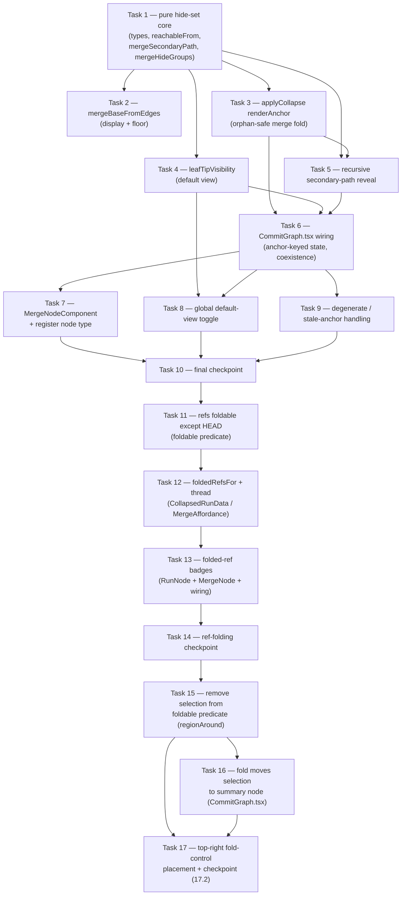

# Implementation Plan: Merge Node Secondary Path

## Overview

This plan implements merge commits as a first-class, collapsible node type in the
git-atlas commit graph. For each secondary parent `Pk` of a merge `M`, the feature
computes a hide set `reachable(Pk) \ reachable(P1)` and folds it behind the visible
merge node, orphan-safe by construction.

The work is almost entirely **pure client-side logic in `ui/src/features/graph/collapse.ts`**,
unit-tested under Vitest with in-memory `CommitNode`/`CommitEdge` fixtures (matching the
project's pure-function testing convention), plus `CommitGraph.tsx` wiring and a new
`MergeNodeComponent.tsx` React Flow node type. The plan builds incrementally: the pure
hide-set core first, then orphan-safe folding reusing `applyCollapse`, then the default
view and recursion, then component wiring and the global toggle, then degenerate cases,
and finally an integration checkpoint.

It reuses the existing Round-3 anchor-keyed collapse plumbing (`regionsFromAnchors`,
`applyCollapse`, `orphanedMembers`, the `foldAnchors`/`userExpanded` state, and the
`__run__`/`__branch__`/`__region__` id scheme) rather than reimplementing folding.

**Follow-up round (Tasks 11–14): Ref Folding.** A layered follow-up (design
`## Ref Folding (follow-up)`, Requirements 14–18) makes **ref-carrying commits
foldable by graph topology** — only the checked-out HEAD commit stays pinned
inline — fixing a defect where a branch/remote-branch/tag ref denied
expand/collapse controls to its own commit and its neighbors. To ensure no ref
silently disappears when folded, the folded refs are surfaced as badges on the
summary node (region rollup and merge affordance), with a distinct outline
treatment for a ref **buried** inside a fold versus a **solid** badge for a ref
on the fold's head member. The change is additive: it narrows `regionAround`'s
`foldable` predicate to a HEAD-only carve-out, threads folded-ref metadata
through the fold pipeline (`foldedRefsFor` → `CollapsedRunData.foldedRefs` /
`MergeAffordance.foldedRefs`), and adds badge rendering to `RunNodeComponent`
and `MergeNodeComponent`. No server change; core edge/fold logic is untouched.

Language: **TypeScript** (the codebase; the design uses TypeScript throughout — no
language selection needed). Tests: **Vitest** (node env, no DOM). React Flow / DOM
rendering is verified via `mise run build` + manual, per project conventions.

## Task Dependency Graph

The 10 tasks build incrementally. The pure hide-set core (Task 1) is the foundation;
`mergeBaseFromEdges` (2), the `renderAnchor` fold extension (3), and the default view
(4) all sit directly on it; recursion (5) needs both hide sets (1) and folding (3);
`CommitGraph.tsx` wiring (6) integrates 3 + 4 + 5; the merge node component (7), the
global toggle (8), and degenerate handling (9) sit on the wiring; the final checkpoint
(10) depends on everything. Tasks 11–14 are the ref-folding follow-up round, layered
on top of the completed feature and running strictly in sequence after Task 10.



The four follow-up tasks build strictly in sequence: the `foldable` predicate
change (11) is the foundation; `foldedRefsFor` + the pipeline threading (12) sits
on it; the component badge rendering (13) consumes the threaded metadata; the
checkpoint (14) verifies the reported bug end-to-end. Tasks 11 and 12 are pure
`collapse.ts` work (Vitest); 13 is DOM/React Flow (build + manual).

**Placement / selection-boundary round (Tasks 15–17).** A further follow-up
(design `## Fold-Control Placement & Selection Boundary`, Requirements 19–23)
runs strictly after Task 14. It drops the `selectedOid` exemption from
`regionAround`'s `foldable` predicate so selection is never a region boundary
(Property 11), moves selection onto the summary node when a fold hides the
selected commit (Property 12), and unifies the fold controls to the top-right so
they do not jump on fold/expand (Property 10). The predicate change (15) is the
foundation; both the selection-follow wiring (16) and the top-right placement (17)
sit on it, and the checkpoint (17.2) runs after 15 and 16. Tasks 15/16 are pure
`collapse.ts` / `CommitGraph.tsx` logic (Vitest); 17 is DOM/React Flow (build +
manual). No server change.

Execution waves (independent leaf sub-tasks that can run in parallel per wave; tasks
in wave N run only after waves 0..N-1 complete; checkpoints/parent tasks excluded):

```json
{
  "waves": [
    { "id": 0, "tasks": ["1.1"] },
    { "id": 1, "tasks": ["1.2"] },
    { "id": 2, "tasks": ["1.3"] },
    { "id": 3, "tasks": ["1.4", "1.5", "2.1", "3.1", "4.1"] },
    { "id": 4, "tasks": ["2.2", "3.2", "4.2", "4.3", "5.1"] },
    { "id": 5, "tasks": ["5.2", "6.1", "6.2"] },
    { "id": 6, "tasks": ["6.3", "6.4", "7.1", "7.2", "8.1", "9.1"] },
    { "id": 7, "tasks": ["7.3", "8.2", "9.2"] },
    { "id": 8, "tasks": ["11.1"] },
    { "id": 9, "tasks": ["11.2", "11.3"] },
    { "id": 10, "tasks": ["12.1"] },
    { "id": 11, "tasks": ["12.2"] },
    { "id": 12, "tasks": ["13.1", "13.2", "13.3"] },
    { "id": 13, "tasks": ["15.1"] },
    { "id": 14, "tasks": ["15.2", "16.1", "17.1"] },
    { "id": 15, "tasks": ["16.2"] },
    { "id": 16, "tasks": ["18.1"] },
    { "id": 17, "tasks": ["18.2", "18.3", "19.1", "19.2"] },
    { "id": 18, "tasks": ["19.3"] }
  ]
}
```

Tasks 18–19 are the fold-control visibility & placement follow-up round, layered
strictly after wave 15. The pure `foldableNodeIds` helper (18.1) is the
foundation; its property test (18.2) and the `CommitGraph.tsx` wiring (18.3) sit
on it, and the two component placement tasks (19.1 — commit/merge date occlusion;
19.2 — run node top-right expand) touch different files and run in parallel with
them; the build+manual verification (19.3) runs last. Task 20 is a checkpoint and
is excluded from the graph.

## Tasks

- [x] 1. Implement the pure hide-set core in `collapse.ts`
  - [x] 1.1 Add merge types and id helpers
    - Add `MergeParents` (`mergeOid`, `firstParent`, `secondaryParents[]`) and `MergeHideSet` (`mergeOid`, `parentIndex`, `secondaryParent`, `oids[]` newest-first, `mergeBase`) interfaces
    - Add `mergePathId(mergeOid, parentIndex)` → `__merge__<oid>__<index>` and `isMergePathId(id)`
    - Extend `isCollapsedRunId` so `__merge__` ids are also treated as summary/hidden-group ids (alongside `__run__`/`__branch__`/`__region__`)
    - _Requirements: 1.1, 6.2_
  - [x] 1.2 Implement `reachableFrom(roots, nodes, edges)`
    - Ancestor closure over parent links (follow `target → sources`), bounded to in-graph commits; out-of-graph roots contribute nothing; `roots ∩ inGraph ⊆ result`
    - _Requirements: 2.1, 10.2_
  - [x] 1.3 Implement `mergeSecondaryPath(mergeOid, parentIndex, nodes, edges)` and `mergeHideGroups(mergeOid, nodes, edges)`
    - `hide(M,k) = reachable(Pk) \ reachable(P1)`, restricted to in-graph, newest-first in graph order; exclude `P1`, all ancestors of `P1`, and `M`; include `Pk` iff `Pk ∉ reachable(P1)`
    - Return `null` for invalid parent index (`< 1` or `>= parents.length`), out-of-graph `Pk`, or empty hide set
    - `mergeHideGroups` yields one non-empty `MergeHideSet` per secondary parent (octopus → up to n-1 groups)
    - _Requirements: 2.1, 2.2, 2.3, 2.4, 2.5, 9.1, 9.4, 10.1, 10.2, 10.3_
  - [ ]* 1.4 Write property test for the hide-set definition
    - **Property 1: Hide-Set Definition**
    - **Validates: Requirements 2.1, 2.2, 2.3, 2.4, 2.5**
    - Over randomized in-memory fixtures assert `hide(M,k) = reachable(Pk) \ reachable(P1)`, `P1`/its ancestors/`M` excluded, `Pk` included iff not already merged
  - [ ]* 1.5 Write unit tests for hide-set edge cases
    - Simple feature merge (feature-only commits hidden); already-merged-again (earlier commits on `P1` excluded); origin-merged-into-branch (a hide-set member has `parents.length >= 2`, proving sub-DAG shape)
    - Empty hide set → `null` (no affordance); out-of-graph `Pk` → `null`; invalid index → `null`
    - _Requirements: 2.4, 2.5, 9.1, 9.4, 10.1, 10.2, 10.3_

- [x] 2. Implement `mergeBaseFromEdges` for display and floor
  - [x] 2.1 Implement `mergeBaseFromEdges(a, b, nodes, edges)`
    - Lowest common ancestor over loaded edges; return `null` when no common ancestor is in the loaded window; wire the result into `MergeHideSet.mergeBase`
    - _Requirements: 2.6, 2.7_
  - [x]* 2.2 Write unit tests for `mergeBaseFromEdges`
    - Expected LCA for linear and branchy fixtures; `null` when no common ancestor in-window; assert the hide set is unchanged whether or not the base is present (under-hide, never orphan)
    - _Requirements: 2.6, 2.7, 10.6_

- [x] 3. Extend `applyCollapse` for merge folding (Option A: existing render anchor)
  - [x] 3.1 Add a `renderAnchor` group option to `applyCollapse`
    - When a group declares `renderAnchor` (an existing commit oid), fold members map to that anchor via `foldedInto` instead of a minted summary node, and no `CollapsedRunData` node is created; the `Pk → M` boundary edge reroutes onto the still-visible `M` and the resulting `M → M` self-loop is dropped as intra-group; leave the first-parent side untouched
    - Keep the existing minted-summary behavior unchanged when `renderAnchor` is absent
    - _Requirements: 3.1, 3.2, 3.3, 3.4_
  - [x]* 3.2 Write property test for orphan-safety of a merge fold
    - **Property 2: Orphan-Safety**
    - **Validates: Requirements 3.1, 3.2, 3.3, 3.4**
    - For every fixture merge/parent, fold `hide(M,k)` via the `renderAnchor` path and assert `orphanedMembers(...) === []`; assert the sole cross-boundary edge is `Pk → M` and it is rerouted onto `M`

- [x] 4. Implement the default view (`leafTipVisibility`)
  - [x] 4.1 Implement `leafTipVisibility(nodes, edges, refs)`
    - Candidate tips = local branch tips (`kind === "branch"`) + HEAD; exclude `remotebranch` and `tag` from the "other tip" comparison; `leafTips` = tips not in `reachableFrom(otherTips)`
    - Return the set of `mergePathId(M, k)` to fold: fold `hide(M,k)` iff none of its members is a leaf tip; leave expanded when any member is a leaf tip
    - _Requirements: 5.1, 5.2, 5.3, 5.4, 8.5, 8.6_
  - [x]* 4.2 Write property test for the default-view leaf-tip rule
    - **Property 4: Default-View Leaf-Tip**
    - **Validates: Requirements 5.1, 5.2, 5.3, 5.4**
    - Assert a line is shown iff its tip is a local tip/HEAD not reachable from another local tip/HEAD, and each non-leaf merge path is folded
  - [x]* 4.3 Write unit tests for default-view worked cases
    - Trunk + one un-merged feature branch → feature line stays open; trunk with a merged feature (ref deleted) → folded behind its merge node; branch caught up to its remote (`remotebranch` at same/newer oid) → does not self-fold; tag on a merged commit → does not keep the line open
    - _Requirements: 5.2, 8.5, 8.6_

- [x] 5. Implement recursive secondary-path reveal
  - [x] 5.1 Recompute hide groups over newly-visible commits after expansion
    - While an enclosing path is folded, inner merges are unrendered; on expand, each inner merge is an independently collapsible merge node; re-run `mergeHideGroups` over the now-visible commits to surface inner hide sets
    - _Requirements: 4.1, 4.2, 4.3_
  - [x]* 5.2 Write property test for recursion
    - **Property 3: Recursion**
    - **Validates: Requirements 4.1, 4.2, 4.3**
    - Nested-merge fixture: fold outer → inner merge not rendered; expand outer → inner merge appears with its own non-empty hide set; expanding inner reveals only its unique commits

- [x] 6. Wire merge fold state into `CommitGraph.tsx`
  - [x] 6.1 Drive merge folds through the anchor-keyed fold model
    - Key each secondary-path fold state on `mergePathId(M, k)` in the existing `foldAnchors`/`userExpanded` state; generalize `collapseRegion`/`expandRegion` to accept a region anchor oid OR a merge-path id (both stable-oid-derived); preserve fold state across a graph-window shift / live-update re-fetch since keys are the stable merge oid
    - Seed the on-load fold set from `leafTipVisibility`; register nothing new in `nodeTypes` yet (component added in task 7)
    - _Requirements: 6.1, 6.2, 6.3_
  - [x] 6.2 Enforce coexistence ordering with region-collapse
    - Compute merge folds first; exclude merge-hidden members from `autoCollapseAnchors`/region seeding; fold both group kinds in a single `applyCollapse` pass; a merge-hidden commit is offered no region control; region candidacy returns after the path is expanded; keep the two memberships disjoint
    - _Requirements: 7.1, 7.2, 7.3, 7.4, 12.1_
  - [x]* 6.3 Write property test for reversibility
    - **Property 5: Reversibility**
    - **Validates: Requirements 6.1, 6.2, 6.3**
    - For a merge-path id, `fold → expand → fold` yields an effective graph identical to the first fold; assert state stays keyed on the merge oid across a simulated window shift
  - [x]* 6.4 Write property test for coexistence precedence
    - **Property 6: Coexistence Precedence**
    - **Validates: Requirements 7.1, 7.2, 7.3, 7.4**
    - A commit eligible for both is claimed by the merge fold; excluded from region seeding while hidden; region candidacy reappears after expanding the merge path; memberships remain disjoint

- [x] 7. Add `MergeNodeComponent.tsx` and register the `merge` node type
  - [x] 7.1 Implement `MergeNodeComponent` with per-secondary-parent affordances
    - New `merge` React Flow node type rendering the merge commit like `CommitNodeComponent` (same handle geometry) plus one hidden-branch affordance per secondary parent with a non-empty hide set (branch glyph + hidden-commit count + tooltip); folded → expand affordance, expanded → collapse affordance (round-trip control); octopus = one independently toggleable badge per secondary parent; `onTogglePath(mergeOid, parentIndex)` calls the generalized expand/collapse
    - _Requirements: 1.1, 1.2, 1.3, 1.4, 1.5, 1.6, 9.2, 9.3, 11.1_
  - [x] 7.2 Register `merge` in `nodeTypes` and route merge commits to it
    - Add `merge: MergeNodeComponent` to `CommitGraph.tsx` `nodeTypes`; render commits with `>= 2` parents as the `merge` type with `hiddenGroups` threaded via node `data`; ensure MiniMap coloring and jump/find treat `__merge__` ids as summary ids (via extended `isCollapsedRunId`)
    - _Requirements: 1.1, 9.2, 9.3_
  - [x] 7.3 Verify component rendering via build + manual
    - `cd ui && npm run build` clean (typecheck + bundle); manually confirm affordance discoverability, octopus multi-badge, expand→collapse round-trip, MiniMap coloring, and jump-to-folded-commit centering (DOM/React Flow — per project conventions)
    - _Requirements: 1.2, 1.3, 1.4, 1.5, 1.6, 9.2, 9.3_

- [x] 8. Implement the global default-view toggle
  - [x] 8.1 Add "Active lines only" (default) vs "Full DAG" toggle
    - A global control that flips the `leafTipVisibility` seed on/off; default to "Active lines only" on load; switching modes must not discard per-merge expand/collapse state
    - _Requirements: 13.1, 13.2, 13.3_
  - [x]* 8.2 Write unit tests for the toggle's seed flip
    - Assert flipping modes changes only the leaf-tip seed and preserves per-merge fold/expand state (pure seed-computation level)
    - _Requirements: 13.3_

- [x] 9. Handle degenerate and stale-anchor cases
  - [x] 9.1 Make stale merge-path anchors inert and re-appliable
    - A folded `mergePathId(M,k)` whose `M` is absent from the window matches no node and hides/strands nothing; when `M` re-enters the window its fold state re-applies (mirrors Round-3 anchor rationale)
    - _Requirements: 10.4, 10.5_
  - [x]* 9.2 Write unit tests for degenerate handling
    - Stale anchor is inert (no hidden/orphaned commit); re-entry re-applies fold; out-of-window merge base under-hides (keeps extra commits visible) rather than orphaning; octopus with mixed empty/non-empty hide sets drops empty ones; overlapping secondary hide sets hide a shared commit once
    - _Requirements: 9.4, 10.4, 10.5, 10.6_

- [x] 10. Final checkpoint — full verification
  - Ensure all tests pass, ask the user if questions arise.
  - Run `mise run test-ui` (all green including new merge tests) and `cd ui && npm run build` (clean typecheck + bundle)
  - Manual verification: default view shows active lines with merged branches folded behind merge nodes; expand/collapse a secondary path (incl. octopus multi-badge and nested reveal); no orphan on fold; region-collapse still works and yields to merge folds; branch panel still scopes fetch; the toggle switches active/full view
  - _Requirements: all; Properties 1–6_

## Tasks (follow-up round: Ref Folding)

- [x] 11. Make ref-carrying commits foldable except HEAD (`regionAround` predicate)
  - [x] 11.1 Narrow the `foldable(x)` predicate to a HEAD-only ref carve-out
    - In `collapse.ts`, in `regionAround`'s inner `foldable(x)`: **remove** the `(refsByOid.get(x)?.length ?? 0) > 0` gate; **replace** it with an `isHead(x)` gate — non-foldable iff `x` carries a HEAD ref (`refsByOid.get(x)` has an entry with `is_head === true` or `kind === "head"`); reuse the `refsByOid` the function already receives (no new parameter)
    - Leave the topology rules unchanged: exactly one in-graph parent, exactly one in-graph child, and `x !== selectedOid`; keep the selected-commit exemption
    - The change propagates for free to `regionsFromAnchors`, `autoCollapseAnchors`, and `resolveMergeAndRegionFold` (all call `regionAround`); merge hide-set folding is untouched (it uses `reachableFrom`, never `foldable`)
    - _Requirements: 14.1, 14.2, 14.3, 14.4, 14.5, 15.1, 15.2, 15.3, 15.4_
  - [x]* 11.2 Write property/unit tests for the foldable-except-HEAD predicate
    - **Property 7: Foldable-by-Topology-Except-HEAD**
    - **Validates: Requirements 14.1, 14.2, 14.3, 14.4, 14.5, 15.1, 15.2, 15.3, 15.4**
    - Use the reported-bug-style fixture (a linear chain with `HEAD → main` at the tip, `origin/main` (remotebranch), a ref-less commit between two ref commits, and a `tag:` commit); assert: a ref-carrying non-HEAD commit is foldable; a commit sandwiched between two ref commits joins a region of `>= 2` members; the `is_head` commit is never a region member; an **interior** HEAD (one parent, one child) is excluded while the region splits/shrinks around it; the common **HEAD-at-tip** (zero children) stays non-foldable by topology; `origin/main` and `tag:` commits fold; a commit carrying a non-HEAD ref vs. one carrying `is_head`/`kind === "head"` — only the latter is treated as HEAD
  - [x]* 11.3 Confirm `autoCollapseAnchors` still exempts the HEAD trunk
    - Add/confirm a test that a long off-trunk region containing ref commits is still seeded, while a region intersecting the HEAD-trunk first-parent chain remains exempt (the walk uses `parents[0]`, independent of `foldable`)
    - _Requirements: 18.1, 18.3_

- [x] 12. Compute and thread folded refs through the fold pipeline
  - [x] 12.1 Add `FoldedRef` + `foldedRefsFor` and thread refs into `applyCollapse`
    - In `collapse.ts` add `interface FoldedRef { ref: RefLabel; buried: boolean }` and a pure `foldedRefsFor(oids, refsByOid): FoldedRef[]` — one entry per (member, ref) pair, `buried = (index > 0)` so a ref on the head member `oids[0]` is `buried:false` and any interior-member ref is `buried:true`; return `[]` when no member carries a ref
    - Add an optional `foldedRefs?: FoldedRef[]` field to `CollapsedRunData`; thread `refsByOid` into `applyCollapse` as a **trailing optional param** (existing call sites in `resolveFoldState` keep compiling) and set `foldedRefs: foldedRefsFor(run.oids, refsByOid)` on each minted summary node; keep `foldedInto`/`renderId`/edge-rerouting/self-loop-drop **unchanged** (additive metadata only)
    - _Requirements: 16.1, 16.3, 16.4, 18.1, 18.2_
  - [x] 12.2 Populate `MergeAffordance.foldedRefs` in `resolveMergeAndRegionFold`
    - Add `foldedRefs: FoldedRef[]` to the `MergeAffordance` interface; where each affordance is built from `visibleMergeHideGroups`, set `foldedRefs: foldedRefsFor(group.oids, refsByOid)` (`resolveMergeAndRegionFold` already has `refsByOid` in scope); pass `refsByOid` through to the `applyCollapse` call so region rollups get `foldedRefs` too
    - _Requirements: 16.2, 16.3, 16.4_
  - [x]* 12.3 Write unit tests for folded-ref computation and threading
    - **Property 8: Folded-Refs Surfaced**
    - **Validates: Requirements 16.1, 16.2, 16.3, 16.4, 18.1, 18.2**
    - Assert `foldedRefsFor` marks a head-member ref `buried:false` and an interior-member ref `buried:true`, emits one `FoldedRef` per (member, ref) pair, and returns `[]` for a group with no refs; assert `applyCollapse` populates `CollapsedRunData.foldedRefs` for a region hiding ref commits (branch/remotebranch/tag); assert `resolveMergeAndRegionFold` populates `MergeAffordance.foldedRefs` for a merged-in secondary path whose members carry refs, ordered head-vs-buried by `group.oids`

- [x] 13. Render folded-ref badges on summary nodes (build + manual — DOM)
  - [x] 13.1 Add head-vs-buried badge rendering to `RunNodeComponent` and `MergeNodeComponent`
    - Add a shared `FoldedRefBadge` (colocated in the graph feature): **solid** style for a head ref (`buried:false`) reusing `CommitNodeComponent`'s badge classes (green HEAD / yellow tag / orange remotebranch / blue branch) via a static hue→class map (Tailwind v4 literal-class safe); **outline/ghost** style for a buried ref (`buried:true`) — transparent bg + border in the same hue + muted text — with a `title` tooltip stating the ref is inside the folded run; distinguish head vs buried by **styling alone** (no position number or count)
    - `RunNodeComponent`: when `d.foldedRefs?.length`, render a `flex flex-wrap gap-1` badge row above the existing count/range header; no row when empty
    - `MergeNodeComponent`: for each folded `hiddenGroups[k]` with `foldedRefs?.length`, render the same badge row on/next to that path's affordance button; existing branch-glyph + hidden-count button unchanged
    - _Requirements: 16.1, 16.2, 17.1, 17.2, 17.3, 17.4_
  - [x] 13.2 Thread `refsByOid` into the fold call from `CommitGraph.tsx`
    - Ensure `refsByOid` reaches `applyCollapse` (via `resolveMergeAndRegionFold`) so `CollapsedRunData.foldedRefs` is populated for run nodes; the merge affordance `foldedRefs` already flow onto merge node `data` via `resolved.affordancesByMerge` — confirm the `hiddenGroups` data shape carries `foldedRefs`
    - _Requirements: 16.1, 16.2, 18.2_
  - [x] 13.3 Verify component rendering via build + manual
    - `cd ui && npm run build` clean (typecheck + bundle) and `mise run test-ui` green; manually confirm: a ref-carrying non-HEAD commit now has an expand/collapse control; a commit between two ref commits has a control; a folded region shows its head ref **solid** and a buried ref **outline** with tooltip; a merge affordance shows the hidden merged-in branch/tag badges without expanding; HEAD stays inline (never folded)
    - _Requirements: 16.1, 16.2, 17.1, 17.2, 17.3, 17.4_

- [x] 14. Ref-folding checkpoint — full verification
  - Ensure all tests pass, ask the user if questions arise.
  - Run `mise run test-ui` (all green including new ref-folding tests) and `cd ui && npm run build` (clean typecheck + bundle)
  - Manual verification of the reported bug on the real repo: `6f21bf7` (`origin/main`), `86bdb6f` (`tag`), and `431b5c2` (between two ref commits) are now foldable and join a region; `772eb2e` (`HEAD → main`) stays pinned inline; every folded ref resurfaces as a badge on the region rollup / merge affordance (head solid, buried outline) so nothing disappears
  - _Requirements: 14, 15, 16, 17, 18; Properties 7–9_

## Tasks (follow-up round: Fold-Control Placement & Selection Boundary)

- [x] 15. Remove selection from the Foldable_Predicate (`regionAround`)
  - [x] 15.1 Drop the selected-commit gate from `foldable(x)`
    - In `collapse.ts`, in `regionAround`'s inner `foldable(x)`: **remove** the leading `if (selectedOid === x) return false;` line so foldability becomes purely topological + the HEAD carve-out: **not HEAD** (`isHead(x)`), **exactly one In_Graph parent** (`parentCount.get(x) === 1`), and **exactly one In_Graph child** (`childCount.get(x) === 1`); nothing about selection or refs
    - Once the gate is gone, `selectedOid` is no longer read inside `regionAround` — **remove it from the signature** (`regionAround(oid, nodes, edges, refsByOid)`) and update every caller: `regionsFromAnchors` (drop its own `selectedOid` param and the pass-through), `autoCollapseAnchors` (currently passes `null`), `resolveMergeAndRegionFold` (stop forwarding `selectedOid` to `regionAround`, but keep `selectedOid` on `resolveMergeAndRegionFold` itself for the §3 selection-follow logic in task 16), and the `CommitGraph.tsx` `regionEligible` memo call site; update any test call sites of `regionAround`/`regionsFromAnchors` accordingly
    - Merge hide-set folding is untouched: `mergeSecondaryPath`/`mergeHideGroups`/`leafTipVisibility` compute hide sets via `reachableFrom`, never via `foldable`, so removing the gate changes nothing on the merge side
    - _Requirements: 20.1, 20.2, 20.3, 20.4, 21.1, 21.2, 21.3, 23.1, 23.2, 23.3, 23.4, 23.5_
  - [x]* 15.2 Write property/regression test for selection-invariant regions
    - **Property 11: Selection Is Not a Region Boundary**
    - **Validates: Requirements 20.1, 20.2, 20.3, 20.4, 21.1, 21.2, 21.3, 23.1, 23.2, 23.3, 23.4, 23.5**
    - Reproduce the confirmed chain (fixed timestamps) `772eb2e (HEAD → main) → 6f21bf7 (origin/main) → 431b5c2 → 86bdb6f (tag) → 578f9c8`; select `431b5c2` and assert `regionAround("6f21bf7", …)` is **not** shrunk to `{6f21bf7}` (before the fix the walk stops down at the selected `431b5c2` and up at HEAD `772eb2e`, collapsing to 1 member / `null`; after the fix it stays a ≥ 2-member region and `6f21bf7` retains a control); assert the region set is byte-for-byte identical across several different selections (selection-invariance); assert the selected commit is itself a member of its region; assert region membership is otherwise unchanged with no orphans (`orphanedMembers(...) === []`); assert HEAD (`772eb2e`) is still excluded and the one-parent/one-child rule is unchanged after the parameter removal

- [x] 16. Move selection onto the summary node when a fold hides the selected commit (`CommitGraph.tsx`)
  - [x] 16.1 Carry selection to the summary node on the fold path in `collapseRegion`
    - Extend the single fold entry point `collapseRegion(anchorId)` (used by both the commit/merge collapse control via `onCollapse` and by `onTogglePath` for merge paths) so that when the folded group's members include the currently selected commit (`selectedOid`), it calls `onSelectCommit` with the fold's representative — the fold's **newest member** `oids[0]` (equivalently `selectionForSummaryNode(...)`, which already returns `oids[0]`); the members come from `regionAround(anchorFromId(anchorId), …)` for a region id and from `mergeSecondaryPath(M, k, …).oids` for a `mergePathId(M, k)` (`isMergePathId(anchorId)`)
    - Folds that do NOT contain the selected commit leave selection unchanged; this matches the existing expand path, which already uses `selectionForSummaryNode` to re-select the representative on `expandRegion`
    - _Requirements: 22.1, 22.2, 22.3_
  - [x]* 16.2 Write unit test for the fold selection-follow decision
    - **Property 12: Fold Moves Selection to the Summary Node**
    - **Validates: Requirements 22.1, 22.2, 22.3**
    - For a fold whose members include the selected commit, assert `selectionForSummaryNode(id, runNodes)` returns the group's newest member `oids[0]` and that it matches the representative the fold path selects; assert a fold whose members do NOT include the selected commit leaves the selection unchanged (the fold-membership test is what gates the re-selection)

- [x] 17. Consistent top-right fold-control placement + checkpoint
  - [x] 17.1 Move the commit/merge collapse control to the top-right corner
    - In `CommitNodeComponent` (and the identical row in `MergeNodeComponent`), lift the `{canCollapse && <button …><ChevronsDownUp/></button>}` out of the mid-left `flex items-center justify-between` hash/date row and position it at the node's **top-right corner** (an absolutely-positioned control or a dedicated top-right header slot), matching where the expand affordance already reads on `RunNodeComponent` / `MergeNodeComponent`, so the control stays in the same top-right spot across folded ⇄ expanded (Property 10); component-only JSX + Tailwind positioning change
    - _Requirements: 19.1, 19.2, 19.3_
  - [x] 17.2 Checkpoint — full verification
    - Ensure all tests pass, ask the user if questions arise.
    - Run `mise run test-ui` (all green including the new selection-boundary tests) and `cd ui && npm run build` (clean typecheck + bundle)
    - Manual verification on the real repo: selecting `431b5c2` no longer strips the fold control from `6f21bf7` or its neighbors; the selected commit keeps its own control; folding a region containing the selected commit moves selection to the rollup showing the newest member; the expand and collapse controls are both at the top-right and the control does not jump on fold/expand
    - _Requirements: 19, 20, 21, 22, 23; Properties 10–12_

## Tasks (follow-up round: Fold-Control Visibility & Placement Fix)

A further follow-up (design `## Fold-Control Visibility & Placement Fix
(follow-up)`, Requirements 24–27, Properties 13–15) runs strictly after Task 17.
It corrects three on-screen defects that survived the placement/selection round:
the top-right control renders *behind* the date on plain (no-ref-badge) nodes,
`RunNodeComponent`'s expand affordance still sits in the top-**left** corner
instead of matching the commit/merge collapse control, and the fold control is
missing on every node that is not a strict run-head. Task 18 broadens eligibility
via a new pure `foldableNodeIds` helper so any member of — or neighbor adjacent
to — a foldable region shows a control and folds its whole containing region
(Property 15); Task 19 fixes placement/occlusion across all three node types
(Properties 13/14); Task 20 is the final verification checkpoint. Task 18 is pure
`collapse.ts` logic (Vitest); Task 19 is DOM/React Flow (build + manual). No
server change.

- [x] 18. Broaden fold-control eligibility via a pure `foldableNodeIds` helper
  - [x] 18.1 Add the pure `foldableNodeIds` helper in `collapse.ts`
    - Add `foldableNodeIds(nodes, edges, refsByOid): { eligible: Set<string>; anchorFor: Map<string, string> }` — a pure, **selection-invariant** sweep (no `selectedOid` param) that discovers every foldable region once (reuse `regionAround` / the same topological foldable predicate — not HEAD, exactly one in-graph parent, exactly one in-graph child), deduped by anchor
    - Mark **every member** of every ≥ 2-member region as eligible (not just the head), plus (per design) the node immediately adjacent in-lane to such a region (the region head's single in-graph child and/or the region tail's single in-graph parent), **excluding** the HEAD_Commit and any merge-hidden commit
    - Build `anchorFor` so every member (and eligible neighbor) of a given region maps to the identical canonical anchor oid that `collapseRegion` expects; never mark a node whose only available fold would collapse a single-commit region
    - _Requirements: 26.1, 26.2, 26.3, 26.4, 26.5, 26.6, 26.7, 26.8, 26.9, 27.1_
  - [x]* 18.2 Write property test for `foldableNodeIds`
    - **Property 15: Eligibility = Participates-In or Adjacent-To a Foldable Region**
    - **Validates: Requirements 26.1, 26.2, 26.3, 26.4, 26.5, 26.6, 26.7, 26.8, 26.9, 27.1, 27.3**
    - Over the confirmed chain fixture and synthetic `CommitNode[]`/`CommitEdge[]` fixtures with fixed timestamps: assert every member of a ≥ 2-member region is eligible (head, every interior member, and tail — no mid-chain gaps), HEAD is excluded, merge-hidden commits are excluded, no single-commit folds are offered, the `eligible` set is byte-for-byte identical across several different `selectedOid` values (selection-invariant), and `anchorFor` maps every member of a region to one identical anchor; assert activating on an interior member (`collapseRegion(anchorFor.get(m))`) folds the identical member set folding from the head produces
  - [x] 18.3 Wire `foldableNodeIds` into `CommitGraph.tsx`
    - Replace the per-node `regionAround(n.oid, …)` `regionEligible` computation with a single `foldableNodeIds(graph.nodes, graph.edges, refsByOid)` call (still skipping `resolved.mergeHidden`); set each node's `data.canCollapse = eligible.has(id)` so the control renders on every eligible node type
    - Wire `onCollapse` so activating the control on **any** eligible node calls `collapseRegion(anchorFor.get(id) ?? id)` — folding that node's whole containing region regardless of which member was clicked; `collapseRegion`, `regionAround`, `applyCollapse`, and the resolver are otherwise unchanged
    - _Requirements: 26.1, 26.2, 27.2, 27.4_

- [ ] 19. Consistent top-right placement + non-occlusion across all three node types
  - [x] 19.1 Stop the fold control from occluding the date on `CommitNodeComponent` and `MergeNodeComponent`
    - Reserve right-padding for the control on the **topmost content row** (the hash/date row), not only the ref-badge row, so the date's right edge never sits under the absolutely-positioned `top-1 right-1` control — whether or not ref badges are present (mirror the existing `canCollapse ? "pr-5" : ""` onto the hash/date row); retain the existing top-right button placement
    - _Requirements: 24.1, 24.2, 24.4, 24.5, 25.1, 25.2_
  - [x] 19.2 Move `RunNodeComponent`'s expand affordance to the top-right corner
    - Move the expand affordance (currently a `ChevronsUpDown` icon in the top-**left** header row) to an absolutely-positioned **top-right** control matching the commit/merge collapse control (same `top-1 right-1`-style corner, same `z`/hit-target); reserve right-padding on the label header row so the run label is not occluded; keep the existing whole-node click-to-expand as a convenience and the `selectionForSummaryNode`-on-expand re-selection unchanged
    - _Requirements: 24.3, 25.3, 25.4, 25.5, 25.6_
  - [ ] 19.3 Verify placement/occlusion via build + manual
    - `cd ui && npm run build` clean (typecheck + bundle) and `mise run test-ui` green; manually confirm on the real repo: every node in — or adjacent to — a foldable stretch shows a top-right control; no control sits behind the date on any node type (with or without ref badges); the run, commit, and merge controls are all top-right; and the control does not jump between corners on fold/expand
    - _Requirements: 24.1, 24.2, 24.3, 24.4, 24.5, 25.1, 25.2, 25.3, 25.4, 25.5, 25.6, 25.7_

- [ ] 20. Fold-control fix checkpoint — full verification
  - Ensure all tests pass, ask the user if questions arise.
  - Run `mise run test-ui` (all green including the new `foldableNodeIds` tests) and `cd ui && npm run build` (clean typecheck + bundle)
  - Manual verification on the real repo that the three original defects are gone: the fold control no longer renders **behind the date** on any node type (defect 1), the run/commit/merge controls all sit in the same **top-right** corner (defect 2, no inconsistent location), and the control is **present on every node** that participates in or borders a foldable region rather than only strict run-heads (defect 3, not missing on some nodes)
  - _Requirements: 24, 25, 26, 27; Properties 13–15_

## Notes

- Tasks marked with `*` are optional test sub-tasks and can be skipped for a faster MVP; core implementation sub-tasks are never optional.
- Each task references specific requirements (and design Correctness Properties where it implements/validates one) for traceability.
- Pure logic in `collapse.ts` is unit-tested under Vitest with deterministic, offline, in-memory fixtures (fixed timestamps); DOM/React Flow rendering (`MergeNodeComponent`) is verified via `mise run build` + manual, per project conventions.
- The plan reuses the existing anchor-keyed collapse plumbing (`regionsFromAnchors`, `applyCollapse`, `orphanedMembers`, `foldAnchors`/`userExpanded`) rather than reimplementing folding; `applyCollapse` gains only a small `renderAnchor` extension (Option A).
- No server (Rust) changes are required — all logic is client-side and topological over the already-loaded DAG.
- **Ref-folding follow-up (Tasks 11–14)** layers on top of the completed merge-node feature: it narrows `regionAround`'s `foldable` predicate to a HEAD-only carve-out (Property 7), threads folded-ref metadata additively through the fold pipeline via `foldedRefsFor` → `CollapsedRunData.foldedRefs` / `MergeAffordance.foldedRefs` (Property 8), and adds head-vs-buried badge rendering to `RunNodeComponent`/`MergeNodeComponent` (Property 9). Core edge/fold logic and the server are untouched.
- **Placement / selection-boundary follow-up (Tasks 15–17)** layers on top of the ref-folding round: it drops the `selectedOid` exemption from `regionAround`'s `foldable` predicate so selection is never a region boundary and removes the now-unused `selectedOid` param from `regionAround` and its callers (Property 11), moves selection onto the resulting summary node when a fold hides the selected commit — driven by `selectionForSummaryNode` = the fold's newest member `oids[0]` (Property 12), and unifies the commit/merge collapse control to the top-right corner so it aligns with the summary-node expand affordance and does not jump on fold/expand (Property 10). It adds no new folding mechanism and requires no server change.
- **Fold-control visibility & placement follow-up (Tasks 18–20)** layers on top of the placement/selection round to correct three surviving on-screen defects: it broadens eligibility via a new pure, selection-invariant `foldableNodeIds` helper so every member of — and neighbor adjacent to — a ≥ 2-member foldable region shows a control (not just strict run-heads) and activating the control on any eligible node folds its whole containing region via `anchorFor` (Property 15); it reserves right-padding on each node type's topmost content row so the top-right control never occludes the date/label regardless of ref badges (Property 13); and it moves `RunNodeComponent`'s expand affordance into the same top-right corner as the commit/merge collapse control so fold and expand share one corner across all three node types (Property 14). Task 18 is pure `collapse.ts` logic (Vitest); Task 19 is DOM/React Flow (build + manual). No server change.
